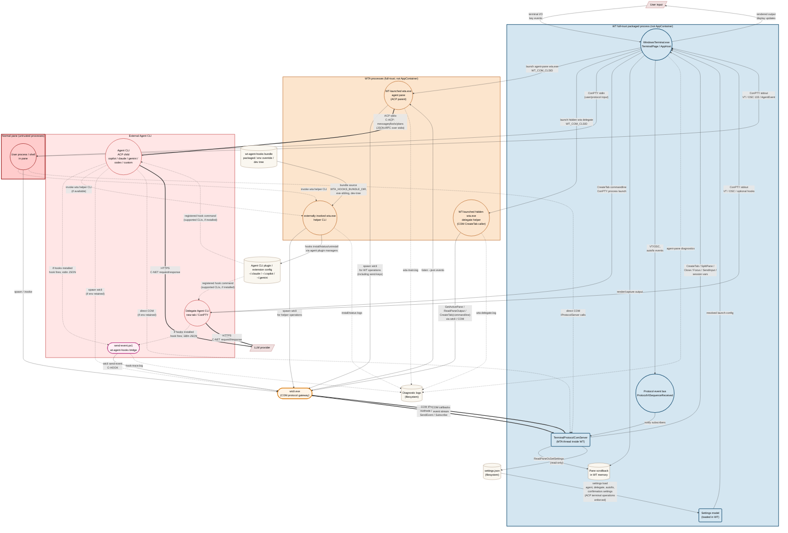

# Intelligent Terminal - Security Model & Threat Analysis

| Field | Value |
|---|---|
| **Document status** | Draft v1.6 |
| **Last updated** | 2026-07-30 |
| **Audience** | Microsoft internal security review |
| **Component** | Windows Terminal fork with embedded AI agents (WT + WTA + WTCLI) |

> **Current implementation addendum (2026-07-30):** Terminal Protocol 3.1
> supersedes the unauthenticated COM behavior described by older passages in
> this threat inventory. WT generates a random per-launch
> `WT_PROTOCOL_TOKEN`; each COM object starts unauthenticated; `Authenticate`
> accepts that host-admin token or a host-signed scoped capability; and every
> query, mutation and subscription returns `E_ACCESSDENIED` until that
> instance authenticates. `wtcli` refuses to run without a token or against
> another protocol version. ACP adapters and native-team worker Agent CLIs
> have `WT_PROTOCOL_TOKEN` and `WT_COM_CLSID` removed from their child
> environments.
>
> Ordinary ConPTY children no longer inherit the host-admin secret. WT mints
> an HMAC-SHA256 capability bound to their `WT_SESSION`, with an explicit
> operation mask, expiry and unique nonce. Only the trusted WTA
> `--connect-master --owner-tab-id` launch shape receives a workspace-scoped
> capability; its target sessions must resolve to that exact native workspace.
> Neither scoped mask includes host-level `CreateTab`. The directly launched
> trusted WTA master retains the host-admin token and must continue scrubbing
> it from ACP and team-worker children.
>
> COM topology results are filtered by the authenticated scope. Event
> subscribers are filtered before enqueue, and scoped callers may send only
> events with an explicit matching workspace/surface identity. Unscoped
> events fail closed for scoped callers. Capabilities expire after seven days
> because ConPTY currently has no refresh channel. Nonces are unique and
> integrity-protected, but they are bearer identifiers rather than a
> server-side one-use/revocation ledger; same-user process inspection and
> compromise of the trusted WTA master remain residual risks.
>
> The detailed sections below preserve historical threat analysis. Where they
> describe a host token inherited by ordinary panes, no subscriber filtering,
> advisory authentication, or fresh confirmation defaults of `auto`, this
> addendum and current source are authoritative.
>
> The ACP client now enforces `aiIntegration.confirmation.{read,create,input}Operations`
> at the operation boundary. Fresh defaults are `prompt`; `deny` fails closed;
> `prompt` emits a permission request; and explicit ACP approvals create a
> short-lived one-shot grant. Current coverage applies to ACP-created terminal
> processes, reading their output and terminating them. It is not a universal
> authorization layer for every direct Terminal Protocol call or every
> context-attachment path.

---

## 0. Review Scope and Security Boundary

This document reviews Intelligent Terminal against **application-level abuse by untrusted code running as the user**, especially code running inside a terminal pane or inside a semi-trusted Agent CLI. In scope are normal product surfaces and data flows: COM activation and method calls, `wtcli` / WTA helper commands, the `wt-agent-hooks` bridge, inherited environment variables, `settings.json`, diagnostic logs, VT / OSC output from pane processes, prompt injection, and Agent CLI behavior.

`send_input` remains exposed on COM `IProtocolServer`, but Terminal Protocol
3.1 requires a valid authenticated capability on every COM instance before any
method can run. Ordinary pane children receive only a capability bound to
their own terminal session; trusted WTA workspace helpers receive only a
capability bound to their native workspace. The host-admin token is retained
only by WT and directly launched trusted host helpers. Same-user process
inspection, bearer reuse before expiry and compromise of a trusted host helper
remain in scope as residual risks; OS compromise of the WT process itself
remains out of scope.

All residual-risk and mitigation statements below should be read against that boundary. If the boundary changes, the threat ratings and P0/P1 priorities must be revisited.

---

## 1. Executive Summary

Intelligent Terminal embeds AI agents into Windows Terminal. The security-sensitive capability is that agents can drive the user's terminal workflow: read pane output, create tabs or panes, and send input into shells.

The current model has a single WT control plane: capability-scoped COM
(`IProtocolServer`), used by `wtcli.exe`, WTA's `CliChannel`, and direct COM
clients. `send_input` is exposed as `SendInput(sessionId, text)`. Protocol 3.1
accepts the random host-admin token only for trusted host clients and
host-signed capabilities for ordinary surface/workspace clients.

Highest-priority residual risks:

| Risk | Why it matters | Current state |
|---|---|---|
| **Direct shell input over COM** | `SendInput` can inject keystrokes into a terminal session. | Surface capabilities can target only their bound `WT_SESSION`; workspace capabilities can target only sessions resolved to their workspace. The trusted host-admin path remains broader. |
| **Create/split over COM** | `CreateTab` / `SplitPane` can spawn caller-chosen commands as WT children. | Scoped capabilities exclude host-level `CreateTab`; workspace capabilities may split only a session in their workspace; surface capabilities cannot split. |
| **Event disclosure/spoofing** | Agent events may include prompts, tool calls and state. | Subscribers are filtered before enqueue; scoped sends require an explicit matching identity. Source authenticity of third-party hook payloads remains open. |
| **Prompt injection** | Protocol access does not prove the LLM's requested action is safe. | ACP terminal create/read/terminate paths enforce `auto`/`prompt`/`deny` and default to `prompt`; direct protocol paths and other context attachments are not yet universally governed. |
| **Autofix-triggered context disclosure** | Crafted OSC 133 failure marks can trigger automatic Autofix analysis that reads source-pane context and sends it to the Agent CLI / LLM before any fix-execution confirmation. | `autoFixEnabled` defaults to `true`; no first-run opt-in or analysis-time confirmation is implemented. |
| **Delegation context disclosure** | `wta delegate` / `?<prompt>` reads active-pane context and passes it to the delegate Agent CLI / LLM as startup prompt context. | No context-specific confirmation or redaction; the assembled delegate command line may also appear in process and diagnostic surfaces. |
| **Scrollback/log disclosure** | Pane output and diagnostic logs may contain secrets, source code, prompts, or command output. | Redaction is not implemented. |
| **Settings persistence via filesystem** | A process running as the user can overwrite `settings.json` and persistently change agent selection, Autofix behavior, or future AI policy knobs. | No meta-confirmation when WT reads policy-relevant settings and launches WTA / agent processes with those values. |

Key security claim: ordinary ConPTY callers are behind a signed,
surface-scoped bearer capability and can target only their bound terminal
session. WTA workspace helpers are workspace-scoped. The directly launched,
trusted WTA master remains a host administrator and therefore belongs to the
trusted computing base.

---

## 2. System Overview

### 2.1 Components

| Component | Process | Identity / boundary notes |
|---|---|---|
| **WT** (`WindowsTerminal.exe`) | Long-lived UI host | Packaged desktop app running at medium integrity in the current configuration. Package-local paths are storage layout, not a low-privilege isolation boundary. |
| **WT-launched WTA** (`wta.exe`) | Master, agent-pane helper, or hidden delegate helper | Production intent is packaged and co-located with WT, but development / PATH fallbacks exist. One trusted master owns the lazy ACP adapter pool; pane helpers route through it and perform WT operations through `wtcli.exe`. Hidden delegate WTA uses COM `CreateTab(commandline)` to start the delegate Agent CLI in a new tab. Binary resolution and identity are part of the trust boundary. |
| **WTA helper CLI** (`wta.exe`) | One-shot helper commands | Invoked by panes, agents, users, Settings UI, or support scripts. It routes through COM / filesystem / third-party plugin managers depending on the subcommand. |
| **Agent-pane ACP Agent CLI / adapter** | `copilot`, `claude`, `gemini`, `codex`, custom; adapter packages launched through tools such as `npx` | Third-party child process spawned by agent-pane WTA and connected over ACP stdio. Treated as semi-trusted. WTA removes `WT_COM_CLSID` and `WT_PROTOCOL_TOKEN` before native or WSL adapter launch. Claude/Codex ACP paths use pinned `npx -y` adapter package versions, which still adds package-manager supply-chain risk beyond local binary resolution. |
| **Delegate / in-pane Agent CLI** | Agent CLI launched in a WT / ConPTY pane, including delegate tabs created by `wta delegate` | Runs as a pane process, not as hidden delegate WTA's ACP stdio child. It can still inherit terminal metadata such as `WT_COM_CLSID`, emit VT / OSC output, and participate in hook bridges if that CLI supports hooks and hooks are installed. |
| **wt-agent-hooks bridge** | Agent CLI plugin/extension invoking `send-event.ps1` | Installed into Claude / Copilot / Gemini through their own plugin or extension managers. It wraps agent hook JSON and invokes `wtcli send-event`; it is an event/status bridge, not a shell-input capability. |
| **WTCLI** (`wtcli.exe`) | CLI client to WT protocol | Package-private binary. Observed WindowsApps / packaged-COM behavior denied direct launch or activation from ordinary external callers in local testing, but pane-launched processes can call COM directly. |
| **TerminalProtocolComServer** | COM server inside WT | Registered as a local server class; exposes reads and several mutations, including `SendInput`. |

### 2.2 Communication channels

| Channel | Endpoints | Transport | Security control today |
|---|---|---|---|
| **C-COM** | `wtcli` / direct COM caller <-> WT | COM `IProtocolServer` (`CLSCTX_LOCAL_SERVER`) | Packaged-COM activation plus protocol 3.1 authentication. WT accepts its random host-admin secret or an HMAC-SHA256 subject/resource/operation/expiry/nonce capability. Ordinary panes receive surface scope; trusted WTA helpers receive workspace scope; topology and events are filtered. |
| **C-ACP** | WTA helper <-> master <-> ACP adapter | JSON-RPC over a current-user named pipe, then parent-created stdio pipes | The helper declares a trusted registry agent ID and owner scope. The master resolves the allowlisted adapter command, owns the stdio handles, and scrubs terminal-control secrets before launch. |
| **C-HOOK** | Agent CLI hook bridge -> `wtcli` / COM -> WTA subscribers | Third-party CLI hook system launches `send-event.ps1`, which calls `wtcli send-event`; WTA receives events through `wtcli --json listen` / COM callbacks | Hook payloads remain untrusted, but scoped senders must include matching identity and subscribers are filtered before enqueue. Cryptographic source-binding of third-party hook payloads remains open. This channel does not carry `send_input`. |
| **C-NET** | Agent CLI <-> LLM provider | HTTPS | Provider-managed auth/TLS; user data may leave the host. |
| **C-VT** | Shell <-> WT | ConPTY VT stream, including OSC marks | Not authenticated; pane output is attacker-controllable when the pane process is malicious. |
| **C-FS** | Processes <-> disk | `settings.json`, diagnostic logs, Agent CLI hook config / bundles | NTFS ACLs and package-local storage layout. This is not a sandbox boundary. |

### 2.3 Typical process tree

```text
WindowsTerminal.exe
+-- wta.exe --master
|   +-- trusted ACP adapter process(es), started lazily
+-- ConPTY -> user shell(s)
+-- ConPTY -> wta.exe --connect-master agent pane
+-- hidden wta.exe delegate helper process(es)
+-- ConPTY -> delegate Agent CLI tab(s)
```

`SharedWta` starts one persistent master. Agent panes use individual helpers
bound to canonical workspace/surface identity. The master starts a trusted ACP
adapter lazily and may retain different adapters in parallel. Delegation can
create short-lived hidden WTA helper processes; those helpers do not directly
parent the delegate Agent CLI. They request WT to create a new tab with the
delegate command line, so the delegate Agent CLI runs as a WT / ConPTY pane
process.

### 2.4 Data-flow diagram



Reading the DFD: WT loads `settings.json` and uses those settings to choose WTA / Agent CLI launch behavior. WT-launched agent-pane WTA and hidden delegate WTA are launched with `WT_COM_CLSID` in the environment. The agent-pane WTA directly parents an ACP Agent CLI; both agent-pane and delegate WTA perform WT operations (including `send_input`) by shelling out to `wtcli.exe`, which speaks COM. Hidden delegate WTA uses COM `CreateTab(commandline)` to ask WT to launch a delegate Agent CLI in a new ConPTY tab. The `externally invoked wta.exe helper CLI` node represents one-shot invocations from panes, agents, users, or Settings UI. All WT control flows through one path: COM `IProtocolServer`. Normal pane output can feed scrollback and the protocol event bus through VT / OSC sequences. The practical pane attacker path is `InPane -> wtcli/direct COM -> WT state/scrollback/settings/topology/send_input`, and a compromised Agent CLI can reach the same COM path if it inherits `WT_COM_CLSID`. Hook events are optional and only exist for supported CLI tools with hooks installed; they take a separate non-input path: `Agent CLI hook -> send-event.ps1 -> wtcli send-event -> COM SendEvent -> agent_event broadcast -> wtcli listen -> WTA listeners / subscribers`. Event disclosure flows through both `EventBus -> ComSrv -> COM callbacks` and hook-originated `SendEvent` broadcasts.

### 2.5 Control plane

| Method group | COM (`IProtocolServer`) | Stock `wtcli.exe` verb |
|---|---:|---:|
| `Authenticate`†, `GetCapabilities` | yes | yes |
| `ListWindows/Tabs/Panes`, `ReadPaneOutput`, `GetActivePane`, `GetProcessStatus` | yes | yes |
| `GetSettings`, `GetSessionVariable` | yes | no current verb |
| `CreateTab`, `SplitPane`, `ClosePane`, `FocusPane`, events | yes | yes |
| `SetSessionVariable` | yes | no current verb |
| `SendInput` (direct shell input) | yes | `send-keys` |

† `Authenticate` compares the supplied token with WT's random per-launch
capability. Every other method checks the authenticated state of that COM
instance and fails with `E_ACCESSDENIED` otherwise.

All WT control, including direct shell input, goes through one COM surface. The highest-risk COM mutations are process creation through `CreateTab` / `SplitPane` and direct keystroke injection through `SendInput`. Other COM mutations remain in scope but have different impact: `ClosePane` is availability / data-loss risk, `FocusPane` is UI redress / focus manipulation, and `SetSessionVariable` is state spoofing / future-consumer risk because it writes pane-local in-memory variables and has no stock `wtcli.exe` verb today. `GetCapabilities()` should stay synchronized with the IDL and stock `wtcli.exe`; the previously stale `set_settings` advertisement is not present in the current implementation.

### 2.6 WTA helper CLI surface

WTA also exposes helper CLI commands for humans, agents, diagnostics, and Settings UI integration. The exact subcommand set is implementation detail; the security-relevant categories are:

| Category | Examples | Security-relevant behavior |
|---|---|---|
| WT operation helpers | `list-*`, `active-pane`, `capture-pane`, `pane-status`, `new-tab`, `split-pane`, `kill-pane`, `wait-for`, `listen` | Route reads, mutations (including `SendInput`), and event subscription through `CliChannel` / `wtcli.exe` / COM. They do not create a separate trust boundary. |
| Delegation helper | `delegate` | Reads active-pane context, builds a delegate Agent CLI command line, then calls COM `CreateTab(commandline)` so WT launches the delegate Agent CLI in a new ConPTY tab. This is a pane-context disclosure and COM process-creation surface. |
| Hook-management helpers | `hooks install`, `hooks status`, `hooks uninstall` | Use third-party Agent CLI plugin / extension managers and filesystem state. They affect persistent hook configuration. |
| Discovery / diagnostics helpers | `pipe-id`, `set-env` / `setenv`, `info`, `test-pipe` and legacy hidden flags | Expose or test WT protocol routing metadata such as `WT_COM_CLSID`. This metadata is not a bearer secret, but it helps a process locate the COM endpoint when observed platform activation behavior allows it. |

These helpers do not grant a new authorization boundary. `wtcli` requires the
ambient signed capability and authenticates its COM instance before invoking a
method. An ordinary pane capability is restricted to that `WT_SESSION`; the
trusted WTA connection-helper launch is restricted to its native workspace.

### 2.7 Agent hook bridge

`wt-agent-hooks` is a persistent event bridge for interactive Claude / Copilot / Gemini CLI sessions running in terminal panes. Installation is explicit through `wta hooks install`, the Settings UI install button, or the WTA setup flow; current code does not install hooks on every ordinary WTA startup. The installer resolves the static bundle from `WTA_HOOKS_BUNDLE_DIR`, the `wta.exe` sibling `wt-agent-hooks\` directory, or a development-tree fallback, then asks each CLI's own plugin / extension manager to install it.

For supported CLI sessions where hooks are installed, the third-party CLI hook system launches `send-event.ps1` for lifecycle, prompt, tool, notification, and error events. The script reads hook JSON from stdin, wraps it with `cli_source`, `agent_session_id`, and `payload`, then calls `wtcli send-event -e <event> -p %WT_SESSION% <json>`. WT receives that as COM `SendEvent`, normalizes it to legacy `agent_event`, and offers it to subscribers. The COM server admits a scoped send only when the envelope carries a matching identity and filters each subscriber before enqueue. WTA consumes authorized events through `wtcli --json listen` and updates its `AgentSessionRegistry` / agent session view. This path is useful telemetry and state synchronization; it is not an authorization path for shell input.

---

## 3. Trust Boundaries and Assets

### 3.1 Trust boundaries

| Boundary | Flows | Enforcement |
|---|---|---|
| **WT <-> pane shell** | ConPTY stdin/stdout | ConPTY process isolation. WT injects terminal metadata such as `WT_SESSION`, `WT_PROFILE_ID`, and sometimes `WT_COM_CLSID`. |
| **WTA master <-> ACP adapter** | ACP stdio | Parent-created pipes. Adapter commands are reconstructed from the trusted registry and allowlist. The adapter is semi-trusted; terminal-control secrets are scrubbed before launch. |
| **WTA helper <-> WTA master** | ACP JSON-RPC over a current-user named pipe | Each helper declares a registry agent ID and canonical owner scope. The master rejects untrusted commands and routes session notifications only to the owning helper. |
| **Agent CLI hook bridge** | Hook JSON -> `send-event.ps1` -> `wtcli send-event` -> COM `SendEvent` -> WTA event listener | Third-party CLI plugin / extension registration plus observed COM activation behavior. Hook payloads are untrusted input, can be spoofed by any COM-allowed sender today, and must not be treated as proof of agent identity or user approval. |
| **WT <-> COM callers** | `IProtocolServer` calls | Packaged-COM activation plus a random per-launch bearer token checked by `Authenticate`; all remaining methods are guarded per COM instance. |
| **All <-> filesystem** | settings, logs, and Agent CLI hook configuration / bundles | NTFS ACLs. Package-local storage affects location, not privilege isolation. |

COM caller restriction in this document means the observed Windows packaged-COM activation behavior for the current package and registration, not a security decision made by `IProtocolServer` methods. Keep regression coverage for ordinary external callers, arbitrary same-package callers, pane children, and cross-integrity callers.

### 3.2 Assets

| Asset | Sensitivity | Notes |
|---|---|---|
| Shell stdin | Critical | Ability to execute commands as the user. |
| `settings.json` | Critical | Can change agent binaries, delegate behavior, Autofix behavior, and confirmation setting knobs. |
| Pane scrollback | Sensitive | May include secrets, command output, source, or copied file contents. |
| Process environment | Sensitive | May include customer secrets. `WT_COM_CLSID` itself is non-secret routing metadata. |
| Agent hook configuration / bundle | Sensitive | Persistent third-party CLI plugin or extension config under user-writable CLI directories, plus the `wt-agent-hooks` bundle resolved from packaged, env-override, or dev-tree locations. Controls what hook script future Agent CLI sessions execute. |
| Diagnostic logs | Sensitive | Known examples under the per-version log dir `…\LocalCache\Local\IntelligentTerminal\logs\<pkgver>\` include `wta-main_*.log`, `wta-delegate.log`, `terminal-agent-pane.log`, `wta-install-hooks.log`, and `hook-trace.log`. Raw user/agent content (prompts, responses, terminal output, typed input) is logged at `trace` only; `info`/`debug` carry lengths/ids/enums. Retention: only the current version's log dir is kept (all other version dirs deleted on start), `wta-cli.log` rotates daily, per-PID helper logs prune after 3 days. |

---

## 4. Threat Actors

| Actor | Capability | Main goal |
|---|---|---|
| **In-pane process** | Runs as the user in a terminal pane; can read env, spawn processes, and use network. Observed local behavior allowed pane children to activate WT COM even without package identity. | Attack other panes, persist, or exfiltrate data. |
| **Prompt-injected LLM** | Can ask the semi-trusted Agent CLI/WTA to perform harmful actions. | Convert untrusted text into agent action. |
| **Compromised Agent CLI** | Runs as WTA child with normal user privileges and ACP stdio access. Terminal-control token and CLSID are scrubbed on the built-in native and WSL adapter paths. | Abuse ACP operations exposed by WTA; locate another credential path; exploit package/runtime substitution. |
| **Hook bridge manipulator** | Controls Agent CLI plugin config, `WTA_HOOKS_BUNDLE_DIR`, a development-tree hook bundle, or `WTCLI_PATH` used by `send-event.ps1`. | Persist hook-script execution, spoof or suppress agent events, or exfiltrate hook payloads. |
| **WTA binary substitution / path hijack** | Controls a `wta.exe` resolved by development or PATH fallback before the intended packaged binary. | Run with WTA's normal environment (including `WT_COM_CLSID`) and gain pane-context COM access. |
| **Drive-by settings modifier** | Can write `settings.json` through the filesystem. | Persistently change future AI-session behavior. |

Out of scope: kernel exploits, compromise or replacement of the intended packaged / signed WT and WTA product binaries, intentional abuse by the interactive logged-in user, and physical access. In scope: untrusted code running as that user in a terminal pane, and product-controlled resolution or fallback paths that select an attacker-controlled WTA, Agent CLI, hook bundle, or `wtcli.exe`.

---

## 5. Key Data Paths

### 5.1 Shell input path

```text
LLM / Agent CLI
  -> WTA CliChannel
  -> wtcli send-keys -t <session_id> <text>
  -> COM IProtocolServer::SendInput(sessionId, text)
  -> TerminalProtocolComServer
  -> TerminalPage target lookup by WT_SESSION GUID
  -> TermControl / ControlCore
  -> ConPTY stdin
```

**Capability statement.** Injecting keystrokes into a shell pane is exposed as
a COM method on `IProtocolServer`. Activation alone is insufficient: the COM
instance must authenticate with WT's host-admin token or a signed scoped
capability. A surface token can call `SendInput` only for its bound session; a
workspace token can call it only for a session resolved to that workspace.

| Step | Guarantee |
|---|---|
| WTA -> WT | `CliChannel` shells out to `wtcli`, which requires `WT_PROTOCOL_TOKEN`, authenticates the COM instance, validates protocol 3.1 and then invokes `SendInput`. |
| Target routing | `session_id` must parse as a non-empty GUID, match a pane, and satisfy the caller's capability: exact session for surface scope or a session resolved to the exact native workspace for workspace scope. |
| Final write | `ControlCore` honors read-only mode before writing to the connection (`src/cascadia/TerminalControl/ControlCore.cpp`, `SendInput` / `_sendInputToConnection`). |

Non-guarantees: if the Agent CLI or LLM is prompt-injected and an operation is
authorized, COM correctly carries the request. ACP terminal create/read/kill
operations now honor `aiIntegration.confirmation.*`; direct protocol calls and
other operation classes do not yet share a universal policy evaluator.
An ordinary in-pane process can use `wtcli`, but only with the signed
surface-scoped capability minted for its own `WT_SESSION`.

### 5.2 Settings mutation path

```text
attacker-controlled user-context process (in-pane shell, Agent CLI, etc.)
  -> overwrite %LOCALAPPDATA%\...\settings.json
  -> future WT launch path reads weakened AI settings / attacker command
```

The mutation path is a direct filesystem write. This is not a new OS privilege — the attacker already runs as the user — but it can persistently change AI behavior without any in-band confirmation. Agent selection, custom agent commands, delegate behavior, Autofix, and future confirmation knobs are all policy-relevant even if some knobs are not enforced today. An Agent CLI (semi-trusted) and a pane-context process can both reach the file: `settings.json` lives at a well-known per-user path that any user-context process can discover via `%LOCALAPPDATA%` or by enumerating package data, so path knowledge is not a meaningful gate. The mitigation is therefore at the *read* side: WT's settings-load / agent-launch path must meta-confirm policy-relevant changes before honoring them, rather than relying on the file being write-protected.

### 5.3 Agent hook bridge path

Install path:

```text
Settings UI / WTA setup / wta hooks install
  -> agent_hooks_installer::ensure_installed()
  -> resolve wt-agent-hooks bundle
  -> Claude / Copilot plugin manager or Gemini extension manager
  -> persistent CLI hook registration
```

Runtime path:

```text
Supported Agent CLI hook fires in a pane, if hooks are installed
  -> send-event.ps1 reads hook JSON from stdin
  -> wraps cli_source, agent_session_id, payload
  -> wtcli send-event -e <agent.*> -p %WT_SESSION% <json>
  -> IProtocolServer::SendEvent
  -> TerminalProtocolComServer legacy agent_event broadcast
  -> wtcli --json listen subscribers
  -> WTA route_agent_event_to_registry()
```

This bridge is a state / telemetry path, not a shell-control authorization path. It improves WTA's ability to display live Agent CLI sessions, tool activity, and notifications, but the event payload is untrusted. Any caller that can reach COM `SendEvent` can currently publish the same legacy `agent_event` shape, so WTA must not treat hook events as proof of agent identity or user approval.

### 5.4 Delegation path

```text
user / command palette / wta helper
  -> wta delegate / ?<prompt>
  -> GetActivePane + ReadPaneOutput(active pane, 30 lines)
  -> append "## Terminal Context" to delegate prompt
  -> build delegate agent commandline
  -> COM CreateTab(commandline)
  -> WT / ConPTY launches delegate Agent CLI in a new tab
  -> delegate Agent CLI / LLM
```

Delegation is an agent-launch and context-transfer path, not a direct shell-input primitive. Current code enriches the delegate prompt with recent active-pane output when available, then builds a startup command line for the delegate Agent CLI. Hidden delegate WTA does not directly spawn that Agent CLI as an ACP stdio child; it asks WT over COM to create a new tab with the delegate command line. That means pane context can reach the delegate Agent CLI / LLM and may also appear in command-line inspection or diagnostic logging surfaces before any separate context-specific confirmation or redaction step. It also means this feature depends on the COM process-creation surface (`CreateTab`).

---

## 6. Threat Table

| Threat | Category | Severity | Current control / gap |
|---|---|---:|---|
| Capability theft or reuse | Spoofing | Medium | Authentication is enforced per COM instance. Ordinary pane tokens have subject/resource/operation/expiry/nonce binding, but remain reusable bearers within that scope until the seven-day expiry; no revocation ledger exists. The trusted WTA host token remains high impact. |
| Event disclosure across scope | Information disclosure | Medium | Scoped subscribers are filtered before enqueue and unscoped payloads fail closed. Residual risk is compromise of the trusted host-admin subscriber or a bug in identity production; hostile cross-process E2E remains required. |
| `SendInput` over COM | Tampering / direct shell execution | High | `SendInput(sessionId, text)` requires exact surface or workspace target authorization. Insert-only mode, universal confirmation and rate limiting are not present for every direct protocol call. |
| `CreateTab` / `SplitPane` arbitrary commandline | Tampering / app-boundary privilege expansion | High; Critical only if cross-integrity method access is ever allowed or the user accepts UAC elevation | Scoped tokens cannot call `CreateTab`; workspace tokens may split only a session in their native workspace; surface tokens cannot split. Trusted host-admin paths remain capable and require provenance/confirmation hardening. |
| `ClosePane` over COM | Denial of service / data loss | Medium | Scoped callers may close only the bound surface or a session inside their workspace. This can still disrupt authorized in-scope work and needs confirmation-policy coverage. |
| `FocusPane` over COM | UI redress / spoofing | Medium | Scoped callers may focus only the bound surface or a session inside their workspace. Universal confirmation and rate limiting remain open. |
| `SetSessionVariable` over COM | Tampering / state spoofing | Low today; Medium if future trusted consumers depend on it | Writes pane-local in-memory session variables and removes them when the value is empty. Stock `wtcli.exe` has no current verb for this method. The present risk is state integrity and future-trust confusion, not arbitrary command execution. |
| `ReadPaneOutput` over COM | Information disclosure | High | Returns arbitrary scrollback; no redaction. |
| `GetSettings` / topology reads | Information disclosure | Medium | Reveals settings, cwd, pids, pane and tab topology. |
| COM DoS | Denial of service | Medium | No per-method rate limit; tab/pane churn can exhaust user-visible resources. |
| Prompt-injected Agent CLI action | Tampering | High | Transport auth cannot solve this. ACP terminal create/read/terminate paths enforce `aiIntegration.confirmation.{read,create,input}Operations` and fresh defaults are `prompt`. Other context and direct protocol operation paths remain outside that evaluator. |
| Malicious Agent CLI or ACP adapter | Supply chain / EoP | Medium | Built-in agent IDs can resolve through PATH / known locations; custom commands are explicit but not identity-pinned. Claude/Codex ACP mode launches pinned packages through `npx -y`, so registry/download/cache compromise remains relevant. Built-in native and WSL adapter launch removes terminal-control token and CLSID. |
| Hook event spoofing / registry poisoning | Spoofing / Tampering | Medium | `wtcli send-event` builds a legacy `agent_event` envelope, and `TerminalProtocolComServer::SendEvent` broadcasts it relying only on observed COM activation behavior. WTA updates its AgentSessionRegistry / agent session view from those events without cryptographic source binding. This does not grant `send_input`, but can mislead attribution, live-session state, and user decisions. |
| Hook bridge bundle or path substitution | Supply chain / Tampering | Medium; High if untrusted bundle override is reachable in production | `wta hooks install` resolves bundle content from `WTA_HOOKS_BUNDLE_DIR`, an exe-sibling packaged directory, or a dev-tree fallback. `send-event.ps1` resolves `wtcli.exe` from PATH, `WTCLI_PATH`, then package install location. A controlled bundle or `wtcli` path can persist code execution in future Agent CLI hook contexts and exfiltrate hook payloads. |
| WTA binary substitution | Supply chain / EoP | High | Production intent is co-located packaged `wta.exe`, but `_DetectWtaPath()` also supports local dev and PATH fallbacks. Any resolved WTA binary runs with WTA's normal environment (`WT_COM_CLSID` etc.) and can drive WT over COM. |
| Diagnostic logs may disclose sensitive data | Information disclosure | Medium | WTA and hook logs may contain command lines, event payload summaries, errors, and metadata. Raw user/agent content (prompts, responses, terminal output, typed input) is gated to `trace` level; the shipping `info` default and `debug` log lengths/ids/enums, not content. Known examples include `wta-main_*.log`, `wta-delegate.log`, `terminal-agent-pane.log`, `wta-install-hooks.log`, and `hook-trace.log` under `logs\<pkgver>\`. Retention is bounded (only the current version's dir kept, daily cli rotation, 3-day per-PID helper prune). |
| Direct `settings.json` file write | Tampering | Critical for persistent AI-policy bypass; not OS privilege escalation | Inherits filesystem ACL behavior; no meta-confirmation for policy changes before WT honors the changed settings in future WTA / agent launches. |
| Crafted OSC marks for Autofix | Information disclosure / Prompt injection / Tampering | High | OSC 133 is shell-controlled. With `autoFixEnabled=true` by default, a crafted failure mark can trigger WTA's Autofix analysis path to submit an agent prompt and read source-pane context via `wt_read_last_prompt` / `wt_read_pane_output` before any fix-execution confirmation. User interaction still gates applying a suggested fix, but pane-context disclosure and prompt-injection exposure can happen during analysis. |
| Delegation context disclosure | Information disclosure / Prompt injection | High | `wta delegate` / `?<prompt>` reads the active pane's recent output (`ReadPaneOutput(..., 30)`) and appends it as terminal context to the delegate prompt. It then uses COM `CreateTab(commandline)` to have WT launch the delegate Agent CLI in a new tab, not `send_input`. Sensitive pane data can be disclosed to the Agent CLI / LLM and exposed through command-line or diagnostic surfaces without a separate context confirmation. |

### Scope boundary note

Same-user OS process introspection and handle-table attacks against WTA are intentionally outside the current review scope. They are therefore not rated as in-scope threats or present residual risks in this table.

### Notes on elevation

`CreateTab` / `SplitPane` impact varies by WT integrity context:

| Scenario | Impact |
|---|---|
| Normal non-elevated WT | Same-user process creation, persistence, and detection evasion. Not a privilege gain. |
| Attacker already inside elevated WT pane | Additional admin child process creation. This is admin-level persistence, not a new elevation because the caller is already admin. |
| Medium-integrity external caller to elevated WT | Local testing observed `IProtocolServer` activation returning `E_ACCESSDENIED`; keep as regression coverage because WT does not set an explicit `CoInitializeSecurity` descriptor. |
| Elevated profile selected | User-assisted elevation if the attacker can trigger a UAC-backed elevated profile and the user approves. |

---

## 7. Mitigations

| Mitigation | Status | Covers |
|---|---|---|
| Sign ordinary ConPTY credentials as surface/workspace capabilities instead of copying the host-admin token | Implemented: HMAC-SHA256 claims include issuer, subject, resource scope, operation mask, expiry and nonce | Cross-surface reads/mutations by ordinary pane callers |
| Gate process creation and `SendInput` by caller scope | Implemented at the COM boundary: surface callers target only their session; workspace callers target only their workspace; scoped callers cannot `CreateTab`; only workspace/admin callers can split | Main COM mutation risk outside the trusted host-admin path |
| Scope lower-impact COM mutations (`ClosePane`, `FocusPane`, `SetSessionVariable`) by source/target pane | Implemented with the same session/workspace target resolution | Pane DoS, UI redress and session-variable spoofing across scopes |
| Filter `Subscribe` delivery and `SendEvent` by authenticated scope before enqueue/dispatch | Implemented; unscoped payloads fail closed for scoped callers | Cross-workspace/surface event disclosure |
| Keep `GetCapabilities()` synchronized with IDL and stock `wtcli.exe` | Current implementation matches reviewed COM surface | Review accuracy; prevents clients from relying on nonexistent or stale methods |
| Implement runtime confirmation enforcement for sensitive read/create/input operation classes | Partial: enforced for ACP create-terminal, terminal-output and kill-terminal paths; not universal | Prompt injection, settings persistence |
| Default `aiIntegration.confirmation.{read,create,input}Operations` to `prompt` on fresh install | Implemented in `MTSMSettings.h` | Prompt-injection blast radius |
| Scrub `WT_COM_CLSID` and `WT_PROTOCOL_TOKEN` from Agent CLI environment | Implemented for built-in native/WSL ACP adapters and native-team workers | Compromised Agent CLI direct COM access |
| Treat hook-originated `agent_event` as untrusted and add source binding / pane scoping before updating WTA session state | Roadmap | Hook event spoofing and registry poisoning |
| Pin the hook bundle and hook-side `wtcli.exe` resolution to packaged locations in production; gate `WTA_HOOKS_BUNDLE_DIR`, dev-tree, and `WTCLI_PATH` overrides behind debug or explicit consent | Planned | Hook bridge supply chain / path substitution |
| Structured audit logging with WTA pid, source pane, target pane, and action type | Partial | Repudiation and incident response |
| Redact secrets in scrollback context and diagnostic logs | Roadmap | Exfiltration to LLM/log files |
| Insert-only mode for shell input recommendations | Partial | Reduces accidental execution; not universal for all `send_input` calls |
| Per-turn rate limit for shell-input calls | Roadmap | Agent runaway / prompt-injection loops |
| Pin or verify built-in Agent CLI binary identity and ACP adapter provenance | Partial — known-location / PATH resolution only; no signature pinning; `npx` adapter package versions / sources are not pinned or vendored | Agent CLI and adapter supply chain |
| Pin or verify WTA binary identity and remove PATH fallback from production launches | Planned | WTA binary substitution |
| Autofix opt-in / first-run hardening | Not implemented; `autoFixEnabled` defaults to `true` | Automatic pane-context disclosure, surprise background analysis, and prompt-injection exposure |
| Delegation context confirmation and prompt transport hardening | Not implemented; delegate prompt is enriched with recent active-pane output and launched through startup command line | Pane-context disclosure to delegate Agent CLI / LLM and command-line/log surfaces |

---

## 8. Residual Risks

1. **Trusted host-admin clients.** WT and the directly launched WTA master retain the host-admin bearer. Compromise of either process retains host-wide control, so WTA binary provenance and child credential scrubbing remain part of the trusted computing base.
2. **Bearer lifetime and revocation.** Scoped tokens expire after seven days and contain a unique integrity-protected nonce, but there is no refresh channel, one-use ledger or revocation list. A token copied through same-user process inspection can be reused until expiry within its original scope.
3. **Prompt and context disclosure.** Autofix, delegation, authorized `ReadPaneOutput`, and diagnostic logs can move pane content, prompts, command lines, event payloads, or model output to Agent CLI / LLM / filesystem surfaces without universal redaction today.
4. **Persistent filesystem and hook trust.** Any user-context process can overwrite `settings.json`, and hook installation persists third-party CLI config outside WT. Policy-relevant settings, hook bundles, hook-side `wtcli.exe`, Agent CLI binaries, ACP adapters, and WTA fallback paths all need production-grade provenance or consent checks.
5. **Platform-dependent COM security.** Cross-integrity COM behavior should be regression-tested with the real `IProtocolServer` IID or a harmless method such as `GetCapabilities`; `IUnknown`-only activation is not sufficient evidence.

---

## 9. Hardening Roadmap

| Priority | Item |
|---|---|
| **P0** | Extend the existing ACP confirmation evaluator to every advertised sensitive operation and context-attachment path. |
| **P0** | Add a refresh/revocation design for long-lived scoped capabilities; until then retain the seven-day expiry and document nonce as unique binding, not one-shot replay prevention. |
| **P1** | Add meta-confirmation for changes to `aiIntegration.confirmation.*`, Autofix, and agent command settings in the WT settings-load / agent-launch path. |
| **P1** | Audit every custom/legacy Agent CLI launcher and preserve the built-in token/CLSID scrub invariant. |
| **P1** | Add structured audit logging and log rotation. |
| **P1** | Add redaction for pane context and diagnostic logs. |
| **P1** | Source-bind or otherwise authenticate hook-originated `agent_event` before WTA updates AgentSessionRegistry state. |
| **P1** | Add per-turn shell-input rate limiting. |
| **P1** | Add a real hostile-client E2E proving surface/workspace denial and event non-disclosure across two panes and two workspaces. |
| **P1** | Autofix opt-in / first-run hardening — change `autoFixEnabled` default to `false` (or surface an analysis-time prompt) so pane context is not sent to the Agent CLI / LLM by surprise. |
| **P1** | Add delegation context confirmation/redaction and avoid putting full pane context into delegate command lines or diagnostic logs. |
| **P2** | Migrate read methods (`ReadPaneOutput`, `GetSettings`, topology reads) after mutation methods. |
| **P2** | Tighten built-in Agent CLI resolution and binary identity checks, and pin/vendor/verify ACP adapter packages launched through package managers such as `npx -y`. |
| **P2** | Tighten hook bundle and hook-side `wtcli.exe` resolution: packaged bundle by default, explicit consent for `WTA_HOOKS_BUNDLE_DIR` / dev-tree / `WTCLI_PATH` overrides. |
| **P2** | Tighten WTA resolution: prefer co-located packaged WTA only in production and gate dev / PATH fallback behind debug settings. |
| **P3** | Consider explicit COM security descriptor / caller allow-list once legitimate callers are reduced. |

### Remote runtime filesystem and browser boundary

Managed remote files are not authorized by filesystem writability or merely by
being inside HOME. `RemoteFileRootPolicy` grants a workspace/target/binding an
opaque root ID and separate read/write/delete capabilities. The canonical path
remains inside the Compute Store and transient node bridge grant. HOME/admin
roots require a broad-access acknowledgement and `files.admin_roots`.

Every operation uses `root_id + relative_path`; traversal, absolute paths,
symlink escape, cross-workspace root reuse and revoked roots fail closed.
Downloads are prepared only after scoped resolution and return no canonical
source/snapshot paths. The legacy unscoped remote download route is disabled.

Browser Surfaces use a per-surface WebView2 user-data folder and
surface-scoped loopback SSH SOCKS proxy. DevTools, web messages, host objects,
password storage, autofill, default script dialogs and browser downloads are
disabled. Navigation is HTTP/HTTPS-only and policy-enforcement failure closes
the browser rather than falling back to a shared profile.

These code-level controls do not prove cookie isolation or cleanup in the
installed app. Cross-workspace Browser Surface tests remain release gates.

---

## 10. Open Questions

1. Should WT or helper processes run with a more restricted token or lower integrity level as defense in depth?
2. Should `WTA` specifically run at a lower integrity level than the user — given it brokers shell input on behalf of a semi-trusted Agent CLI — even though same-user handle-table attacks are out of scope?
3. Can WT/WTA scrub `WT_COM_CLSID` from Agent CLI children without breaking legitimate agent tooling?
4. Should hook installation remain explicit, and should hook bundle / `WTCLI_PATH` overrides be disabled in production builds?
5. Can Agent CLI, ACP adapter package, and WTA binary identity be verified without breaking user-installed CLI workflows?
6. Are diagnostic logs ever collected by telemetry or support tooling? If yes, redaction becomes mandatory rather than best effort.
7. Should `settings.json` ACLs be tightened beyond inherited per-user filesystem defaults?

---

## 11. References

- `src/cascadia/TerminalConnection/ConptyConnection.{h,cpp}` - agent-pane WTA launch
- `src/cascadia/WindowsTerminal/TerminalProtocolComServer.{h,cpp}` - COM surface (`IProtocolServer`, including `SendInput`)
- `src/cascadia/TerminalProtocol/TerminalProtocol.idl` - protocol interface
- `tools/wta/src/shell/wt_channel/cli_channel.rs` - WTA's COM transport (shells out to `wtcli.exe`)
- `tools/wta/src/main.rs`, `tools/wta/src/coordinator.rs` - delegation context collection and delegate command-line construction
- `tools/wta/src/agent_registry.rs`, `tools/wta/src/protocol/acp/client.rs` - Agent CLI / ACP adapter command construction and launch
- `tools/wta/src/agent_hooks_installer.rs` - `wt-agent-hooks` install / status / uninstall logic
- `tools/wta/wt-agent-hooks/` - Agent CLI hook bridge bundle and `send-event.ps1`
- `tools/wta/src/app.rs`, `tools/wta/src/agent_sessions.rs` - hook event routing into WTA session state
- `src/tools/wtcli/main.cpp` - CLI surface
- STRIDE methodology
