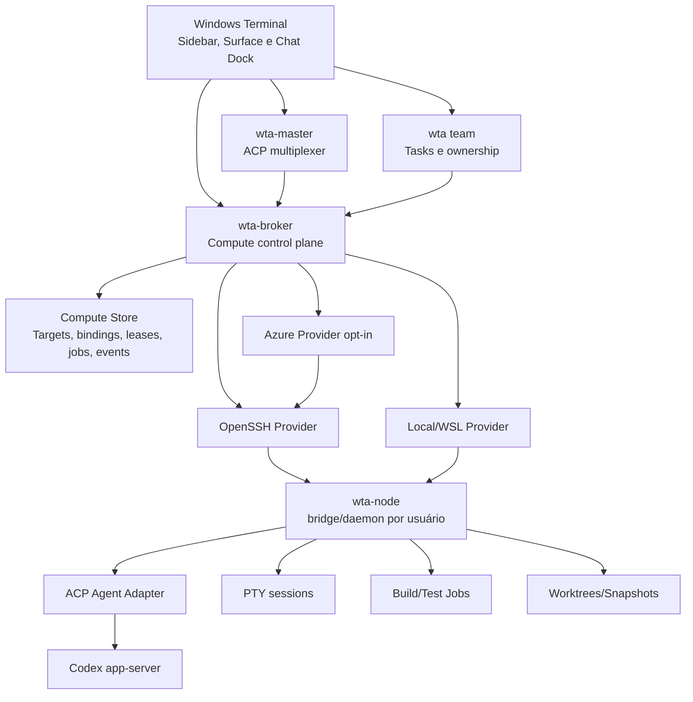

# Plano completo: control plane distribuído de agentes e compute

**Status:** implementação local concluída em 2026-07-27; os gates que dependem
de hosts SSH/Azure reais permanecem explicitamente não verificados. Evidências,
limites e artefatos estão registrados em
[`distributed-agent-compute-control-plane-implementation-report.md`](distributed-agent-compute-control-plane-implementation-report.md).

**Produto:** Intelligent Terminal, fork do Windows Terminal

**Branch observada ao elaborar o plano:** `feature/agent-workspace-launcher`

**Commit base observado:** `6635b61a9`

**Data da auditoria:** 2026-07-27

**Escopo:** SSH confiável, runtime remoto versionado, Managed Agent Surfaces,
placement sticky, execução distribuída explícita, worktrees/snapshots/handoff,
compute elástico e operação/observabilidade.

**Fora de escopo:** WebView2, shim `tmux` para Claude Teams/OMX, exposição
pública de app-server/ACP, interceptação transparente de comandos digitados no
PTY e reutilização automática de máquinas de produção.

> **Current source note (2026-07-30):** this is the original implementation
> plan. The delivered control plane remains inside the canonical `wta compute`
> store/CLI rather than a separate long-running `wta-broker` daemon. A separate
> Browser Surface was added after this plan; WebView2 is still absent from the
> native Chat Pane. See
> [`../fork-architecture-and-status.md`](../fork-architecture-and-status.md)
> and the dated implementation report for current status.

---

## 1. Resumo executivo

O Intelligent Terminal já possui a base correta para um terminal multiagente:

- a hierarquia canônica `Window → Workspace → Pane → Surface`;
- Chat Dock seguindo a surface focada;
- sessões ACP isoladas por surface;
- `wta-master` como multiplexador ACP;
- `wta team` como control plane nativo de tasks, ownership e heartbeat;
- Terminal Protocol com identidade e capabilities;
- surfaces heterogêneas usando perfis do Windows Terminal;
- UI nativa XAML, sem WebView2.

O próximo passo não é ampliar o `wta-master` até ele virar um monólito. A
extensão correta é acrescentar um control plane de compute separado:

```text
Windows Terminal / Chat Dock
  ├─ wta-master  → conversa ACP e roteamento por surface
  ├─ wta team    → tasks, ownership, heartbeat e coordenação
  └─ wta-broker  → targets, placement, leases, jobs e decisões
                         │
                         └─ SSH → wta-node → PTY/agente/build/test
```

Princípios definitivos:

1. **ACP conversa; não agenda máquinas.**
2. **SSH transporta; não é o modelo de estado.**
3. **WTA controla; não duplica a hierarquia do Terminal.**
4. **Surface identifica uma sessão interativa.**
5. **Worktree isola escrita.**
6. **Jobs declarados podem ser roteados; comandos arbitrários do PTY não.**
7. **Agente interativo recebe um HomeTarget sticky.**
8. **Build/test pode usar um ExecutionTarget diferente e uma réplica
   imutável.**
9. **Coordinator é um papel opcional dentro de `wta team`, não um modo do
   Chat Dock.**
10. **Toda ação da UI possui uma primitiva CLI/RPC equivalente.**

---

## 2. Evidência e baseline observados

### 2.1 Estado do checkout

No momento da elaboração deste plano:

- a árvore contém **169 entradas não limpas**;
- 130 são arquivos rastreados modificados;
- 39 são arquivos não rastreados;
- o checkout contém implementação anterior de P0–P5 e arquivos pertencentes ao
  usuário;
- nenhum reset, limpeza ampla ou reformat global é permitido.

Antes da primeira alteração de runtime, a execução deve produzir um manifesto
de baseline com:

- commit e branch;
- `git status --short`;
- versões de Rust, Cargo, MSBuild, Windows SDK, Node, OpenSSH e adapters ACP;
- hashes dos binários instalados e dos binários de build;
- testes que já falham antes da mudança;
- lista de gates opt-in indisponíveis.

Um checkpoint Git só será criado se houver autorização explícita. O plano não
transforma automaticamente o dirty checkout em commit.

### 2.2 Capacidades já presentes

O relatório
`doc/specs/surface-scoped-agent-workspaces-implementation-report.md` registra
como implementados, com diferentes níveis de validação:

- criação heterogênea de surfaces;
- IDs e lifecycle de surface;
- escopo ACP por surface;
- equipes nativas;
- capabilities do Terminal Protocol;
- Chat Dock XAML seguindo foco;
- Agents & Tasks na sidebar.

Essas capacidades são dependências do plano novo e não serão reimplementadas
em stores ou hierarquias paralelas.

### 2.3 Lacunas confirmadas no código atual

1. `src/cascadia/TerminalSettingsModel/SshHostGenerator.cpp` enumera apenas
   blocos simples `Host` seguidos de `HostName`.
2. O gerador não é uma resolução completa de `Include`, `Match`, precedência,
   `ProxyJump`, `ProxyCommand` e demais opções do OpenSSH.
3. Não há modelos canônicos de `ComputeTarget`, `SurfaceBinding`,
   `ExecutionRequest`, `Lease` ou `PlacementDecision`.
4. Não há `wta-broker` nem `wta-node`.
5. Não há bootstrap remoto versionado, handshake de node ou reconexão de
   sessão remota.
6. Não há placement entre máquinas.
7. Não há execução explícita remota com snapshot/manifesto de artefatos.
8. O E2E real de SSH/ACP/reconnect permanece não verificado.

### 2.4 Referências externas validadas

- O cmux mantém `Window → Workspace → Pane → Surface → Panel`, usa helper
  remoto versionado/verificado, JSON-RPC por stdio, sessão persistente e
  reconnect exponencial.
- O ACP suporta várias sessões por conexão e streaming bidirecional, mas
  transportes remotos padronizados ainda evoluem; ACP não define scheduler de
  compute.
- O Codex remoto oficial usa SSH para iniciar/gerenciar app-server no host
  remoto e trabalha sobre o filesystem e o shell daquele host.
- Codex app-server oferece stdio estável; WebSocket é experimental e não deve
  ser a dependência do MVP remoto.
- Worktrees são a primitiva correta para tarefas paralelas graváveis; uma
  branch não pode estar checked out simultaneamente em dois worktrees.
- A Remote Execution API é referência conceitual para inputs por digest,
  execução imutável, logs e artefatos; não é uma dependência obrigatória do
  primeiro release.

### 2.5 Gates anteriores que precisam ser preservados

RC-P0–RC-P8 estendem P0–P5; não tornam automaticamente completos os gates
anteriores. Antes de habilitar Managed Remote Surfaces por default, fechar ou
revalidar ao menos:

| Gate existente | Dependência do programa remoto |
|---|---|
| `C230` Cold-cache Codex ACP | prova que o adapter base inicia de forma confiável |
| `C232` Heterogeneous workspace | prova que perfis distintos continuam coexistindo |
| `C235` Rapid focus isolation | impede streaming no Chat Dock errado |
| `C238` Two real agents | prova o caminho nativo de team com adapters reais |
| `C244` Native conversation body | valida renderer, teclado e acessibilidade reais |
| `C245` Move/restore lifecycle | garante que bindings sobrevivem a move/restore |

Esses resultados continuam separados:

- contrato/unit test não fecha E2E;
- inspeção visual não fecha autenticação/rede;
- adapter mock não fecha Codex/Claude/Gemini reais;
- um teste local não fecha reconnect SSH.

---

## 3. Problemas de usuário que o plano resolve

### Jornada A — vários Codex em paralelo

David abre um workspace para um projeto, cria várias Managed Agent Surfaces e
executa uma sessão Codex em cada uma. Cada surface:

- possui conversa própria;
- possui worktree próprio;
- pode rodar localmente ou em um target remoto;
- permanece ligada ao mesmo target durante a sessão;
- aparece em Agents & Tasks com estado e uso de recursos;
- pode coordenar ou observar outras surfaces somente pelas capabilities do
  workspace/team.

O Chat Dock sempre conversa com o agente da surface focada.

### Jornada B — agente interativo remoto

O usuário cria uma Managed Codex Surface em `devbox-linux`. O broker escolhe ou
valida o target, o node inicia o runtime remoto e o Chat Dock se conecta àquela
sessão. Uma queda de rede:

- não cria outro agente;
- tenta reanexar à mesma sessão;
- mostra estado e backoff;
- falha de forma acionável quando a sessão realmente terminou.

### Jornada C — build/test em outra máquina

Um agente interativo continua no PC, mas executa:

```text
wta compute exec --class build --target auto -- npm run build
```

O broker cria uma réplica imutável, escolhe um target elegível, transmite logs,
permite cancelamento e devolve artefatos com hashes. O comando só muda de
máquina porque foi solicitado explicitamente.

### Jornada D — handoff seguro

Uma tarefa Codex muda do PC para um devbox:

1. interrompe o turn ativo de forma controlada;
2. gera snapshot do estado Git permitido;
3. materializa/revalida um worktree exclusivo no destino;
4. abre/resume a sessão no destino;
5. muda o binding somente após o novo runtime ficar saudável;
6. mantém rollback para o runtime anterior até o commit do handoff.

### Jornada E — administração de targets

O usuário adiciona um alias SSH, revisa `ssh -G`, capabilities e trust tier,
prova a conexão e então permite seu uso por determinados projetos. Um target
de produção nunca aparece como destino automático de agente/build.

---

## 4. Terminologia canônica

### 4.1 Hierarquia visual

```text
Window
  └─ Workspace (tab nativa projetada na sidebar)
       └─ Pane (região de split)
            └─ Surface (sessão empilhada dentro do pane)
                 └─ Panel (terminal; browser permanece fora deste plano)
```

### 4.2 Hierarquia de execução

```text
WorkspacePolicy
  ├─ eligible_targets[]
  ├─ default_placement_policy
  └─ project/trust constraints

SurfaceBinding
  ├─ home_target
  ├─ managed agent session ou plain terminal
  ├─ worktree writer lease
  └─ ACP/app-server identity

ExecutionRequest
  ├─ execution_target
  ├─ immutable source snapshot
  ├─ command argv + environment allowlist
  └─ logs/artifacts/result
```

### 4.3 Nomes que não podem ser confundidos

| Termo | Significado |
|---|---|
| `HomeTarget` | Máquina sticky que possui a sessão interativa e o worktree gravável |
| `ExecutionTarget` | Máquina usada por um job finito e reprodutível |
| `Managed Agent Surface` | Surface cujo lifecycle de agente é conhecido pelo WTA |
| `Plain Terminal Surface` | Shell/SSH comum sem agente gerenciado associado |
| `Coordinator` | Worker/role opcional de uma equipe |
| `Broker` | Control plane de compute; não conversa com o modelo |
| `Node` | Runtime por usuário no target; executa primitivas autorizadas |
| `Snapshot` | Estado de entrada imutável identificado por hash |
| `Lease` | Direito temporário e auditável sobre target, slot ou worktree |

---

## 5. Invariantes não negociáveis

1. Uma Managed Agent Surface mapeia para no máximo uma sessão interativa viva.
2. Uma sessão interativa possui um único `HomeTarget` por vez.
3. Um worktree gravável possui exatamente um writer lease.
4. Dois agentes não recebem simultaneamente o mesmo worktree gravável.
5. Jobs recebem inputs imutáveis e nunca adquirem writer lease do worktree
   original.
6. Mudança de `HomeTarget` é handoff explícito, não rebalanceamento automático.
7. `Plain SSH Surface` não é promovida silenciosamente a agente gerenciado.
8. Chat Dock nunca troca de agente sem mudança de foco confirmada por IDs e
   `focus_generation`.
9. ACP não é usado como scheduler ou canal de arquivos grandes.
10. Nenhum app-server, ACP adapter, node RPC ou daemon escuta em interface
    pública por default.
11. Host key alterada falha fechada.
12. Helper remoto executado deve corresponder ao hash esperado.
13. Target de produção/restrito nunca entra em placement `auto`.
14. Secrets só atravessam fronteiras por allowlist explícita.
15. Job destrutivo ou não idempotente nunca recebe retry automático.
16. Toda decisão de placement pode explicar inclusões, exclusões e score.
17. Toda mutação possui actor, target, correlation ID e resultado.
18. UI e agentes usam o mesmo store e as mesmas operações.

---

## 6. Arquitetura-alvo



### 6.1 Separação de responsabilidades

#### `wta-master`

- mantém o comportamento existente;
- possui conexões ACP;
- roteia sessões e eventos por scope de surface;
- pede ao broker para criar/reanexar um runtime remoto;
- não mantém inventário de máquinas nem agenda jobs.

#### `wta-broker`

- fonte canônica de targets, bindings, leases, jobs e decisões;
- aplica policy, trust e quotas;
- escolhe placement;
- coordena providers;
- publica snapshots imutáveis para UI/CLI;
- não interpreta prompts nem decide conteúdo de tasks.

#### `wta-node`

- binário portátil, por usuário, sem privilégios administrativos;
- expõe JSON-RPC local por bridge stdio;
- possui PTYs/sessões que sobrevivem ao bridge SSH;
- materializa réplicas;
- executa jobs;
- mede health/capabilities/recursos;
- nunca aceita conexão de rede pública.

#### `wta team`

- permanece fonte canônica de coordenação;
- workers podem apontar para `surface_binding_id`;
- tasks podem solicitar `ExecutionRequest`;
- ownership lógico continua separado de placement físico.

---

## 7. Contratos de dados

Os contratos serão versionados e compartilhados entre broker, node, CLI,
Terminal e testes. Campos desconhecidos devem ser preservados ou ignorados de
forma compatível; versões principais incompatíveis falham claramente.

### 7.1 `ComputeTarget`

```text
schema_version
id
display_name
provider: local | wsl | ssh | azure
endpoint:
  ssh_alias?
  wsl_distro?
  azure_resource_id?
os
arch
capabilities[]
toolchains{}
trust_tier: personal | development | restricted | production
project_allowlist[]
agent_slots
build_slots
memory_bytes
cost_policy
power_policy
health
last_probe_at
disabled
metadata
```

O registro nunca armazena private keys, bearer tokens ou environment completo.

### 7.2 `WorkspaceComputePolicy`

```text
workspace_id
project_root_identity
eligible_target_ids[]
placement_policy: local_first | balanced | cost_first | performance
default_agent_target: sticky_auto | explicit
default_job_target: auto | explicit
required_trust_tier
allowed_network_classes[]
secret_allowlist[]
production_targets_allowed: false
```

### 7.3 `SurfaceBinding`

```text
binding_id
window_id
workspace_id
pane_id
surface_id
focus_generation
kind: plain_terminal | managed_agent
agent_id?
adapter_kind?
acp_session_id?
remote_session_id?
home_target_id?
worktree_id?
writer_lease_id?
state
created_at
updated_at
```

### 7.4 `PlacementRequest` e `PlacementDecision`

```text
PlacementRequest
  request_id
  workspace_id
  workload: interactive_agent | build | test | lint | browser | gpu
  requirements
  candidate_policy
  preferred_target_id?
  excluded_target_ids[]

PlacementDecision
  decision_id
  selected_target_id?
  candidates[]
    target_id
    eligible
    exclusion_reasons[]
    score_components{}
    total_score
  policy_version
  created_at
```

### 7.5 `ExecutionRequest`

```text
request_id
workspace_id
class
argv[]
cwd_relative
snapshot_id
requirements
target_policy
environment_allowlist[]
declared_outputs[]
idempotency_key?
idempotent
destructive
timeout_ms
requested_by
```

Strings de shell não substituem `argv[]`. Quando o usuário pede semântica de
shell, o shell escolhido aparece explicitamente como o executável em `argv[0]`.

### 7.6 `ExecutionJob`

```text
job_id
request
target_id
node_session_id
lease_id
state
attempt
started_at
completed_at?
exit_code?
termination_reason?
stdout_stream_id
stderr_stream_id
artifacts[]
decision_id
```

### 7.7 `SnapshotManifest`

```text
snapshot_id
format_version
repository_identity
base_commit
tracked_patch_digest
untracked_entries[]
deleted_entries[]
mode_entries[]
symlink_policy
ignored_includes[]
excluded_secret_candidates[]
overall_digest
created_by
created_at
```

O manifesto é inspecionável antes da transferência.

### 7.8 `Lease`

```text
lease_id
kind: agent_slot | build_slot | writer | target_lock
subject_id
target_id?
workspace_id
owner
issued_at
expires_at
heartbeat_at
state
```

---

## 8. Persistência e ownership de estado

### 8.1 Store local do host

Usar o root package-private já resolvido por
`tools/wta/src/runtime_paths.rs`:

```text
<IntelligentTerminal State>/compute/v1/
  targets.json
  bindings.json
  leases.json
  jobs/<job-id>/state.json
  snapshots/<snapshot-id>/manifest.json
  events.jsonl
  migrations/
```

Arquivos grandes, caches e logs ficam no root local/cache, não em LocalState.

### 8.2 Policy de projeto

Configuração compartilhável e sem secrets:

```text
<repo>/.intelligent-terminal/compute-policy.json
```

Preferências locais que não devem ser commitadas ficam no package-private
store e sobrescrevem apenas campos explicitamente permitidos.

### 8.3 Store remoto

Por usuário:

```text
Linux:   ~/.local/state/intelligent-terminal-node/
Windows: %LOCALAPPDATA%\IntelligentTerminalNode\

  versions/
  runtime/
  sessions/
  jobs/
  replicas/
  logs/
```

Sockets Unix e named pipes usam permissões/ACL do usuário. Nenhum listener TCP
é necessário para o MVP.

### 8.4 Atomicidade

- escrita por temp file + flush + replace;
- lock bounded com detecção de lock stale;
- append-only events;
- migration idempotente;
- recovery escolhe o último snapshot íntegro;
- corruption nunca é “corrigida” apagando estado silenciosamente.

---

## 9. Superfície de controle e paridade agente/UI

Toda ação de UI será implementada primeiro como operação de domínio e exposta
por CLI/RPC. O Chat Dock pode chamar as mesmas primitivas por shell; um MCP
futuro será apenas um adapter fino.

### 9.1 Targets — CRUD completo

```text
wta compute target discover
wta compute target add
wta compute target get
wta compute target list
wta compute target update
wta compute target remove
wta compute target probe
wta compute target enable
wta compute target disable
wta compute target trust
```

### 9.2 Bindings e sessões

```text
wta compute binding create
wta compute binding get
wta compute binding list
wta compute binding update
wta compute binding delete
wta compute session attach
wta compute session detach
wta compute session resume
wta compute session stop
```

### 9.3 Placement

```text
wta compute place preview
wta compute place explain
wta compute place pin
wta compute place unpin
```

### 9.4 Jobs

```text
wta compute exec --class <class> --target <id|auto> -- <argv...>
wta compute job get
wta compute job list
wta compute job logs
wta compute job cancel
wta compute job retry
wta compute job artifacts
wta compute job delete
```

### 9.5 Snapshots e handoff

```text
wta compute snapshot create
wta compute snapshot inspect
wta compute snapshot list
wta compute snapshot materialize
wta compute snapshot delete
wta compute handoff preview
wta compute handoff apply
wta compute handoff rollback
```

### 9.6 Node e operação

```text
wta compute node bootstrap
wta compute node status
wta compute node upgrade
wta compute node doctor
wta compute lease list
wta compute lease revoke
wta compute events
wta compute top
```

### 9.7 Capability map

Manter em `doc/compute-capability-map.md` uma tabela:

| Ação da UI | Operação de domínio | CLI/RPC | Capability | Teste |
|---|---|---|---|---|
| Add target | target.create | `target add` | compute.target.write | parity |
| Probe target | target.probe | `target probe` | compute.target.read | integration |
| Create remote agent | binding.create | `binding create` | compute.agent.create | E2E |
| Cancel job | job.cancel | `job cancel` | compute.job.cancel | E2E |
| Handoff | handoff.apply | `handoff apply` | compute.handoff | E2E |

CI falha quando uma ação nova não possui operação, capability e teste.

---

## 10. Transporte SSH

### 10.1 Descoberta

O parsing próprio serve apenas para **enumerar aliases concretos**. A
resolução final pertence ao OpenSSH:

```text
ssh -G <alias>
```

Requisitos:

- ler configs de usuário e sistema;
- seguir `Include` com limite de profundidade e detecção de ciclo;
- ignorar `Host` que contenha wildcard/negação;
- aceitar múltiplos aliases no mesmo bloco;
- nunca inferir que `HostName` precisa estar no mesmo arquivo/bloco;
- usar `ssh -G` para HostName, User, Port, IdentityFile, ProxyJump,
  ProxyCommand, canonicalization e precedência;
- preservar o OpenSSH como autoridade de opções.

### 10.2 Segurança de argumentos

- alias não pode começar com `-`;
- nenhum comando é construído por concatenação de shell;
- opções originadas em URL/deep link são allowlisted;
- identity, raw `-o`, command, ProxyCommand e forwarding nunca vêm de deep
  link externo;
- a UI mostra preview do destino efetivo;
- primeiro trust é explícito;
- host key alterada falha fechada;
- `StrictHostKeyChecking=no` nunca é injetado pelo produto.

### 10.3 Conexão

- provider chama `ssh.exe` diretamente com argv;
- keepalive default só é acrescentado quando config efetiva não o define;
- reconnect: 3s, 6s, 12s, 24s, 48s, máximo 60s, com jitter e cancelamento;
- autenticação interativa permanece visível em uma surface apropriada;
- ControlMaster é uma otimização opcional após E2E no Windows, nunca
  requisito arquitetural.

### 10.4 Arquivos

- bootstrap pequeno pode usar `scp`/SFTP;
- snapshots e artefatos usam arquivo/stream dedicado;
- JSON-RPC não carrega blobs grandes em Base64;
- cada transferência verifica tamanho e SHA-256.

---

## 11. Protocolo `wta-node`

### 11.1 Processo e lifecycle

`wta-node bridge --stdio`:

1. localiza ou inicia o daemon do usuário;
2. autentica no socket local;
3. faz proxy JSON-RPC por stdio;
4. pode morrer com o SSH sem matar sessões do daemon.

O daemon:

- possui as sessões;
- mantém PTYs e process trees;
- mantém heartbeats de jobs;
- encerra recursos órfãos conforme policy;
- não escuta na rede.

### 11.2 Handshake

```text
initialize
  client version/protocol
  nonce
  requested capabilities

initialize result
  node version/protocol
  os/arch
  capabilities
  limits
  process/session features
  filesystem features
  server nonce
```

Versão incompatível gera erro determinístico antes de criar processo.

### 11.3 Métodos atômicos

```text
health/read
capabilities/list
resource/read
session/create
session/get
session/list
session/attach
session/detach
session/resize
session/write
session/stop
job/create
job/get
job/list
job/cancel
job/logs/read
snapshot/materialize
artifact/list
artifact/read
lease/heartbeat
shutdown
```

CRUD incompleto não é aceito sem registrar explicitamente a razão de
segurança.

### 11.4 Bootstrap

1. probe `uname`/PowerShell para OS/arch;
2. selecionar artefato exato;
3. upload para nome temporário;
4. verificar SHA-256 no destino;
5. aplicar permissão de execução;
6. rename atômico para diretório versionado;
7. executar handshake;
8. manter versão anterior para rollback;
9. apagar apenas versões fora da retenção e sem sessão viva.

O manifesto de hashes é embarcado no host. Assinatura de release continua um
gate separado de builds locais.

---

## 12. Política de placement

### 12.1 Default: Sticky Auto

Para agente interativo:

1. escolher target uma vez;
2. adquirir agent slot e writer lease;
3. criar/reusar worktree;
4. iniciar adapter/agente;
5. manter target e worktree;
6. reanexar após queda;
7. exigir handoff para mover.

### 12.2 Constraints obrigatórias

- OS e arquitetura;
- toolchains;
- memória e slots;
- adapter/Codex instalado;
- autenticação disponível no próprio target;
- trust tier;
- project allowlist;
- network class;
- segredo autorizado;
- target não ser produção restrita;
- estado saudável;
- política de custo/power.

### 12.3 Score

- afinidade com projeto;
- repo e caches aquecidos;
- CPU, memória e I/O disponíveis;
- latência interativa;
- taxa de falha;
- fila;
- custo;
- bateria/suspensão;
- anti-afinidade para jobs pesados.

Pesos são versionados. `place explain` mostra cada componente.

### 12.4 Leases

- heartbeat;
- expiração;
- renovação;
- revogação explícita;
- stale não causa reatribuição automática de writer;
- recovery exige prova de que o owner anterior terminou ou foi isolado.

---

## 13. Réplicas, worktrees, snapshots e handoff

### 13.1 Modos de fonte

#### `RemoteNative`

O projeto já vive no target. Nenhuma sincronização implícita.

#### `GitReplica`

- clone/fetch por identidade de repositório;
- checkout por commit;
- worktree exclusivo;
- primeiro MVP para agentes e jobs.

#### `SnapshotReplica`

- base commit;
- patch tracked;
- untracked explicitamente incluído;
- deletes;
- mode bits;
- symlinks tratados por policy;
- hash integral;
- secrets suspeitos excluídos e mostrados no preview.

#### `CAS`

Adiado até métricas mostrarem que snapshots completos são gargalo.

### 13.2 Um writer

- writer lease vincula `workspace + worktree + agent`;
- build/test usa cópia imutável;
- generated output retorna como artefato;
- patch de generated sources só é aplicado se base/generation ainda
  corresponde;
- conflito nunca é resolvido por overwrite silencioso.

### 13.3 Handoff transacional

Estados:

```text
previewed
→ source_quiescing
→ snapshot_created
→ destination_materialized
→ destination_started
→ destination_verified
→ committed
```

Falha antes de `committed` preserva source e permite rollback. Após commit:

- source perde writer lease;
- destino vira HomeTarget;
- IDs de handoff correlacionam as duas sessões;
- histórico do Chat Dock permanece associado à surface;
- processo vivo não é “migrado”; a sessão é retomada/recriada.

---

## 14. Integração ACP e Codex

### 14.1 ACP genérico

- stdio permanece transporte padrão;
- uma conexão pode multiplexar várias sessões quando o adapter suporta;
- capabilities reais do agent governam `session/new`, `load`, `resume`,
  `close`, slash commands, modes e config;
- WTA não inventa feature que o adapter não anunciou;
- reconnect prefere `session/resume`; `session/load` é usado quando o cliente
  precisa reidratar histórico e a capability existe.

### 14.2 Codex remoto

Caminho MVP:

```text
Chat Dock
→ wta-master
→ SSH provider
→ wta-node
→ codex-acp remoto
→ Codex app-server remoto
```

Requisitos:

- `codex` e adapter disponíveis no PATH do login shell remoto;
- autenticação ocorre no host remoto;
- cwd é caminho remoto;
- filesystem e comandos são remotos;
- app-server não é exposto publicamente;
- stdio/SSH é preferido ao WebSocket experimental;
- versões de adapter/app-server entram no handshake e diagnóstico.

Uma integração direta WTA ↔ Codex app-server pode ser avaliada depois, caso
seja necessária para parity que o ACP não exponha. Ela não substitui o caminho
ACP agente-neutro sem ADR e testes de compatibilidade.

### 14.3 Plain terminal versus Managed Agent

| Surface | Chat Dock |
|---|---|
| PowerShell/WSL/SSH plain | “Nenhum agente gerenciado associado” |
| Codex managed local | conversa com sessão local da surface |
| Codex managed remote | conversa com sessão remota da surface |
| Claude/Gemini/other ACP managed | capabilities anunciadas pelo adapter |

Detectar um processo chamado `codex` no foreground pode enriquecer
observabilidade, mas não concede ownership nem controle ACP retroativo.

---

## 15. Execução roteada

### 15.1 Regra de explicitude

Nunca interceptar:

```text
npm test
pytest
pwsh ./build.ps1
```

Roteamento ocorre por:

```text
wta compute exec --class test --target auto -- npm test
```

ou por task declarada/Command Palette/tool do agente.

### 15.2 Lifecycle do job

```text
queued
→ placing
→ staging
→ running
→ collecting
→ succeeded | failed | cancelled | timed_out
```

### 15.3 Logs e cancelamento

- stdout/stderr ordenados e incrementais;
- sequência e timestamps;
- backpressure bounded;
- cancelamento mata process tree;
- daemon verifica órfãos;
- timeout é enforced no node;
- perda do bridge não equivale automaticamente a cancelamento.

### 15.4 Retry

Somente se:

- `idempotent=true`;
- `destructive=false`;
- falha classificada como transitória;
- limite de tentativas não esgotado;
- idempotency key estável.

O UI sempre mostra tentativa e motivo.

### 15.5 Artefatos

- outputs declarados;
- manifesto de tamanho/hash/mime;
- download explícito;
- limites;
- paths relativos;
- traversal e symlinks externos rejeitados.

---

## 16. Compute elástico

### 16.1 Provider interface

```text
discover
get
probe
start
stop/deallocate
estimate_cost
open_transport
```

OpenSSH, local e WSL existem primeiro. Azure entra somente após o core estar
estável.

### 16.2 Azure

- resource allowlist;
- subscription/tenant explícitos;
- budget diário/mensal;
- max runtime;
- idle deallocate;
- quota;
- tags de ownership;
- nenhuma criação/deleção sem preview e confirmação;
- credenciais nunca persistidas no ComputeTarget.

### 16.3 Produção

VM HERMES e VPS Hostinger permanecem:

- `trust_tier=production`;
- `disabled_for_auto_placement=true`;
- project allowlist estrita;
- operações específicas e autorizadas;
- nunca usadas como devbox genérico.

---

## 17. UX nativa

### 17.1 Sidebar

Workspace card mostra, sem poluição:

- nome/projeto;
- agents ativos;
- target badge (`Local`, `WSL`, `devbox`);
- working/attention/error;
- CPU/memória agregada opcional;
- unread/jump.

### 17.2 Surface header

Managed Agent Surface mostra:

- agent/model;
- HomeTarget;
- cwd/worktree;
- estado de conexão;
- ação `Reconnect`, `Handoff`, `Stop`.

Plain Terminal mostra somente profile/target, sem falsa sessão ACP.

### 17.3 Chat Dock

- continua seguindo foco;
- não adiciona seletor Workspace/Surface/Team;
- header informa a surface e o target atuais;
- queda mostra reconnect/backoff;
- troca de foco durante streaming não move mensagens;
- operações cross-surface/team aparecem como tools/capabilities, não como
  escopo de conversa.

### 17.4 Target Manager

Settings ou overlay XAML nativo:

- targets;
- health;
- capabilities;
- trust;
- projetos permitidos;
- slots;
- probe;
- bootstrap/upgrade;
- remove/disable.

### 17.5 New Surface

O seletor unificado passa a incluir:

```text
Type
  Plain terminal profile
  Managed Codex
  Managed Claude
  Managed ACP agent

Run on
  Sticky Auto
  This computer
  WSL distro
  SSH target
```

Selecionar um perfil terminal e selecionar um agent runtime são decisões
distintas. O menu canônico do Windows Terminal continua sendo a fonte dos
perfis.

### 17.6 Task Manager

`wta compute top` e overlay nativo correlacionam:

- window/workspace/pane/surface;
- agent/session;
- target/node;
- process tree;
- CPU, memória e I/O;
- job/task;
- ações de focus, stop, restart e inspect.

---

## 18. Segurança e threat model

### 18.1 Trust boundaries

1. Windows Terminal host.
2. `wta-master`.
3. `wta-broker`.
4. provider SSH.
5. `wta-node`.
6. agent adapter/model.
7. task/job payload.
8. remote target filesystem.

Cada boundary possui identidade, capability e audit event.

### 18.2 Proteções obrigatórias

- scoped capability por operação;
- node por usuário;
- socket/named pipe com ACL;
- nonce e protocolo no handshake;
- hash do helper;
- host key verification;
- argv sem shell implícito;
- cwd relativo dentro da réplica;
- environment allowlist;
- redaction;
- limits de payload/log/artefato;
- timeouts;
- process-tree cleanup;
- fail closed em versão/identidade/policy desconhecida.

### 18.3 Secrets

- nunca entram em snapshot por default;
- `.worktreeinclude` não implica envio remoto automático;
- cada entrada sensível requer policy e target trust compatível;
- credenciais do Codex ficam no target em que o Codex executa;
- tokens de transporte não reutilizam credenciais OpenAI;
- diagnóstico mostra presença/origem, não valor.

### 18.4 Auditoria

Registrar:

- actor;
- operation;
- workspace/surface/job/target IDs;
- decisão;
- resultado;
- duração;
- correlation ID.

Não registrar por default:

- prompts/transcripts;
- terminal buffer;
- private keys/tokens;
- environment completo;
- conteúdo de source/snapshot.

---

## 19. Roadmap de implementação

Para evitar colisão com P0–P5 do plano anterior, este programa usa o prefixo
**RC** (Remote Compute). A correspondência com a proposta original é direta:
`RC-P0` a `RC-P8`.

### Gate RC-0 — baseline e provas de risco

**Objetivo:** impedir que um refactor distribuído seja construído sobre
suposições não testadas.

Entregas:

1. manifesto de baseline;
2. teste de caracterização do SSH generator atual;
3. spike `ssh -G` com `Include`, wildcard, ProxyJump e precedência;
4. spike de `wta-node` portátil em Windows e Linux;
5. spike Codex remoto real por SSH/stdio;
6. ADRs e schemas iniciais;
7. feature flags criadas, default off.

Gate:

- nenhum source change amplo antes dos três spikes;
- falhas reais registradas como `refuted`;
- ausência de host remoto mantém E2E como `unverified`.

### RC-P0 — ADRs, contratos e store

**Resultado:** modelos versionados e store consistente, ainda sem execução
remota.

Entregas:

- ADR-009 a ADR-014;
- crate/módulo portátil de contratos;
- ComputeTarget, WorkspacePolicy, SurfaceBinding, Placement, Job, Snapshot,
  Lease e Event;
- store atômico e migrations;
- target/binding CRUD;
- capability map;
- schema/contract tests.

Arquivos prováveis:

- `tools/wta/src/compute/*`;
- `tools/wta/src/main.rs`;
- `tools/wta/src/runtime_paths.rs`;
- novo core portátil se o spike confirmar;
- `doc/compute-capability-map.md`.

Aceite:

- round-trip e migration;
- corrupção falha sem apagar;
- CLI JSON estável;
- nenhuma UI store paralela.

Rollback:

- flag off;
- arquivos novos ignorados pela versão anterior.

### RC-P1 — OpenSSH Provider

**Resultado:** aliases confiáveis, resolvidos pela semântica real do OpenSSH.

Entregas:

- descoberta concreta;
- `ssh -G`;
- trust/probe;
- preview;
- option-injection protection;
- health;
- target UX;
- remoção da dependência do parser simples como fonte canônica.

Aceite:

- configs com Include/ProxyJump;
- alias wildcard ignorado;
- host-key change fail closed;
- sem shell concatenation;
- UI e CLI retornam mesma resolução.

### RC-P2 — `wta-node`

**Resultado:** runtime remoto versionado, verificável e reanexável.

Entregas:

- artefatos Windows/Linux x64 inicialmente;
- bootstrap e hash;
- daemon por usuário;
- bridge stdio;
- handshake/capabilities;
- sessões PTY;
- reconnect;
- resource probe;
- doctor/upgrade/rollback.

Aceite:

- bridge pode cair e reanexar à mesma PTY;
- hash incorreto bloqueia execução;
- versão incompatível não cria sessão;
- daemon não escuta publicamente;
- processo órfão é detectado.

### RC-P3 — Managed Remote Surface

**Resultado:** uma surface pode possuir agente ACP remoto real.

Entregas:

- binding HomeTarget;
- picker Type + Run on;
- adapter remoto;
- Chat Dock por foco;
- state/reconnect;
- stop/detach/resume;
- Codex remoto;
- labels truthful para plain SSH.

Aceite:

- duas surfaces no mesmo node não compartilham sessão;
- foco nunca mostra agente errado;
- queda reanexa;
- stop de uma surface não mata a outra;
- Codex trabalha no cwd remoto.

### RC-P4 — Sticky Placement

**Resultado:** placement seguro, explicável e estável.

Entregas:

- registry;
- constraints;
- scoring;
- preview/explain;
- leases/slots;
- pin/unpin;
- workspace policies;
- production exclusion.

Aceite:

- decisão determinística com mesmos inputs;
- cada exclusão tem reason;
- target de produção nunca auto;
- stale writer não é reassigned;
- pin inválido falha claramente.

### RC-P5 — Routed Execution

**Resultado:** build/test/lint explícitos em targets elegíveis.

Entregas:

- ExecutionRequest/Job;
- GitReplica;
- staging;
- logs;
- cancel/timeout;
- artifacts;
- retries seguros;
- team task integration;
- Command Palette.

Aceite:

- comando normal continua local;
- job mostra target + snapshot;
- cancel mata árvore;
- perda de bridge não duplica job;
- artefato possui hash;
- job destrutivo não retry.

### RC-P6 — Snapshot e Handoff

**Resultado:** dirty state e sessão podem mudar de host com rollback.

Entregas:

- SnapshotReplica;
- preview/redaction;
- materialização;
- handoff transaction;
- one-writer enforcement;
- generation checks;
- recovery.

Aceite:

- tracked/untracked/delete/mode cobertos;
- secret não autorizado excluído;
- falha no destino preserva source;
- dois writers impossíveis;
- handoff concluído mantém Chat Dock/surface identity.

### RC-P7 — Elastic Compute

**Resultado:** targets Azure de desenvolvimento podem iniciar/deallocate sob
budget.

Entregas:

- provider lifecycle;
- Azure resource allowlist;
- cost preview;
- budget/quota;
- idle shutdown;
- audit;
- manual pin.

Aceite:

- nenhuma criação/deleção implícita;
- deallocate respeita sessão/job vivo;
- budget bloqueia;
- produção continua excluída.

### RC-P8 — Operação avançada

**Resultado:** Task Manager distribuído, métricas e otimizações comprovadas.

Entregas:

- `compute top`;
- process ownership;
- health dashboards;
- cache metrics;
- capacity history;
- diagnóstico sanitizado;
- CAS somente se métricas justificarem;
- MCP facade opcional, fina e sem store próprio.

Aceite:

- processo pesado leva à surface owner;
- métricas não contêm conteúdo;
- ações de UI possuem CLI/RPC;
- cache pode ser desativado sem quebrar correção.

---

## 20. Sequência de PRs

1. Baseline, riscos e ADRs.
2. Contratos/store/events.
3. CLI target CRUD e parity tests.
4. OpenSSH resolver/probe/trust.
5. Target Manager XAML.
6. `wta-node` handshake/bootstrap.
7. Node PTY persistence/reconnect.
8. SurfaceBinding e picker Type/Run on.
9. ACP remoto mock/loopback.
10. Codex remoto real opt-in.
11. Placement preview/explain.
12. Leases/slots/pin.
13. GitReplica jobs/log/cancel/artifacts.
14. Team ↔ ExecutionRequest.
15. SnapshotReplica.
16. Handoff transacional.
17. Task Manager distribuído.
18. Azure provider.
19. Hardening, accessibility, localization e docs.
20. Remoção de flags somente após rollout observado.

Cada PR:

- preserva o dirty checkout;
- não mistura formatação ampla;
- atualiza capability map;
- inclui teste que falha sem a mudança;
- documenta gate opt-in pulado;
- mantém rollback.

---

## 21. Estratégia de testes

### 21.1 Unitários

- schemas/migrations;
- SSH alias enumeration;
- parsing de `ssh -G`;
- argv injection;
- constraints/score/explain;
- lease races;
- retry classifier;
- snapshot manifests;
- path traversal;
- redaction;
- state machines de node/job/handoff.

### 21.2 Property/fuzz

- config SSH malformada;
- JSON-RPC frames;
- event ordering;
- snapshot paths;
- artifact manifests;
- protocol version negotiation.

### 21.3 Contract

- host/broker/node schemas;
- CLI JSON;
- surface IDs;
- capability names;
- app-server/ACP capability projection;
- old/new version compatibility.

### 21.4 Integração determinística

- fake `ssh.exe` registra argv;
- fake node;
- node loopback;
- drop/reconnect do bridge;
- two surfaces/two sessions;
- job cancel;
- snapshot/materialize;
- handoff failure rollback;
- production exclusion.

### 21.5 E2E local

- local target;
- WSL como runtime distinto de compatibilidade;
- duas Managed Codex Surfaces;
- focus switch durante streaming;
- worktrees separados;
- build job separado;
- Task Manager ownership.

WSL valida portabilidade e protocolo, mas não conta como máquina adicional de
capacidade física.

### 21.6 E2E remoto opt-in

- host SSH isolado;
- bootstrap/upgrade;
- host-key mismatch;
- real Codex authentication;
- remote filesystem writes;
- disconnect/reconnect;
- job/log/artifact;
- handoff local ↔ remote;
- two-agent team.

### 21.7 Segurança adversarial

- alias `-o...`;
- deep-link option injection;
- helper tampered;
- stale token;
- wrong user;
- socket permissions;
- public listener scan;
- secret in snapshot;
- symlink escape;
- path traversal;
- cancel race;
- duplicate idempotency key;
- stale writer lease;
- production target auto-placement.

### 21.8 UX/accessibility

- 100%, 125%, 150%;
- high contrast;
- teclado;
- Narrator/UI Automation;
- localization en-US/pt-BR;
- narrow window;
- target offline;
- long names;
- reconnect state;
- multiple windows.

---

## 22. Gates de qualidade

### Rust/WTA

```powershell
Get-Process wta -ErrorAction SilentlyContinue | Stop-Process -Force
cargo test --manifest-path tools/wta/Cargo.toml
cargo build --manifest-path tools/wta/Cargo.toml `
  --target x86_64-pc-windows-msvc
```

Se o grafo de dependências Rust mudar:

```powershell
$env:RUSTUP_TOOLCHAIN = 'stable'
pwsh -File .\build\scripts\Generate-WtaThirdPartyNotices.ps1
```

### Node portátil

- Windows x64 build/test;
- Linux x64 build/test;
- protocol conformance;
- checksum manifest;
- smoke em usuário sem admin.

### Terminal nativo

- projetos nativos afetados;
- unit tests;
- scripts estruturais;
- package build;
- installed smoke;
- inspeção visual.

### Regra de evidência

Relatórios usam quatro categorias:

- **observed:** executado nesta build/ambiente;
- **supported:** comprovado por unit/contract test;
- **refuted:** teste falhou;
- **unverified:** gate externo, credencial, rede ou manual não executado.

Mock não é E2E real. Build verde não prova reconnect, SSH, autenticação ou
acessibilidade.

---

## 23. Feature flags e rollout

Flags temporárias:

```text
computeControlPlane
sshTargetRegistry
wtaNodeBootstrap
managedRemoteSurfaces
stickyPlacement
routedExecution
snapshotHandoff
elasticCompute
distributedTaskManager
```

Ordem:

1. contracts/store em shadow mode;
2. target discovery read-only;
3. node manual/opt-in;
4. remote surface explicit target;
5. placement preview sem aplicar;
6. placement apply opt-in;
7. jobs locais, depois remotos;
8. snapshots/handoff;
9. Azure;
10. default on somente após E2E e telemetry local.

Rollback:

- desliga feature;
- preserva layout;
- não apaga worktrees/snapshots;
- interrompe novos placements;
- sessões existentes podem ser detached/stop explicitamente;
- node mantém versão anterior;
- schema anterior continua legível.

---

## 24. Riscos e mitigação

| Risco | Impacto | Mitigação |
|---|---|---|
| Dirty checkout amplo | regressão sem causa clara | baseline e PRs estreitas |
| `wta-master` monolítico | acoplamento e crashes globais | broker separado |
| Node não portátil | remoto limitado | spike Windows/Linux antes do core |
| Semântica SSH duplicada | conexões erradas | `ssh -G` como autoridade |
| ControlMaster inconsistente no Windows | reconnect frágil | não torná-lo requisito |
| Sessão duplicada após queda | custo/corrupção | remote session ID + attach |
| Dois writers | perda de código | writer lease fail closed |
| Secret em snapshot | vazamento | preview + allowlist + scanner |
| Retry destrutivo | duplicação/dano | idempotency + classifier |
| App-server público | comprometimento | stdio/SSH, no listener público |
| ACP usado como scheduler | protocolo conflado | compute RPC próprio |
| UI sem parity | agente incapaz | capability map + CI |
| Target de produção no pool | risco operacional | trust tier + hard exclusion |
| Azure sem budget | custo | preview, quota e deallocate |
| CAS precoce | complexidade | medir antes de implementar |

---

## 25. Decisões a registrar em ADR

1. **ADR-009 — WTA compute is separate from ACP master.**
2. **ADR-010 — SSH is transport; OpenSSH owns config resolution.**
3. **ADR-011 — Surface HomeTarget is sticky.**
4. **ADR-012 — Explicit routed execution only.**
5. **ADR-013 — One writer per worktree.**
6. **ADR-014 — Versioned stdio node bridge.**
7. **ADR-015 — Project policy versus package-private runtime state.**
8. **ADR-016 — Production targets excluded from automatic placement.**
9. **ADR-017 — Snapshot format and secret boundary.**
10. **ADR-018 — Handoff recreates/resumes; it does not migrate a live process.**
11. **ADR-019 — ACP primary, Codex app-server adapter optional.**
12. **ADR-020 — UI/agent action parity via domain operations.**

### 25.1 Decisões mantidas até o último momento responsável

| Decisão aberta | Evidência necessária | Prazo máximo |
|---|---|---|
| `wta-node` como crate separado ou segundo binário do package WTA | spike cross-compile Windows/Linux, impacto de dependencies/build.rs | Gate RC-0 |
| JSON files versus SQLite no broker | concorrência e volume observados no store RC-P0 | antes de RC-P4 |
| Unix socket/named pipe abstraction própria ou crate | spike de daemon e ACL nos dois sistemas | RC-P2 |
| ControlMaster no Windows | E2E de multiplexação/reconnect no OpenSSH instalado | depois de RC-P2 |
| `codex-acp` versus adapter app-server direto | capability/parity gap observado | depois de RC-P3 |
| formato de archive do SnapshotReplica | benchmarks com repos pequenos/grandes e symlinks | início de RC-P6 |
| CAS/chunk dedupe | bytes transferidos, tempo e taxa de repetição | RC-P8 |
| assinatura além de SHA-256 para node local | modelo de distribuição/release assinado | antes de publicação externa |

Nenhuma dessas decisões pode bloquear contratos de domínio já estáveis, mas
também não deve ser congelada por conveniência antes da evidência indicada.

---

## 26. Itens deliberadamente adiados

- browser surface/WebView2;
- public HTTP/WebSocket broker;
- live process migration;
- generic shell-command interception;
- transparent bidirectional filesystem sync;
- multi-writer CRDT;
- tmux compatibility core;
- Claude Teams shim;
- global fleet across organizations;
- remote desktop/device control;
- GPU scheduler antes de existir hardware elegível;
- CAS/chunk dedupe antes de métricas;
- MCP facade antes da CLI/RPC estabilizar;
- publicação/assinatura externa sem release gate próprio.

---

## 27. Definition of Done geral

A iniciativa só pode ser chamada de completa quando:

- [ ] todos os contratos são versionados;
- [ ] target CRUD e trust funcionam por UI e CLI;
- [ ] OpenSSH é a fonte de resolução;
- [ ] node é verificado por hash;
- [ ] node Windows e Linux passam;
- [ ] sessão remota sobrevive à perda do bridge;
- [ ] duas surfaces nunca compartilham sessão por engano;
- [ ] Chat Dock sempre segue a surface correta;
- [ ] Plain SSH é rotulada sem agente;
- [ ] placement é sticky e explicável;
- [ ] produção não entra em auto-placement;
- [ ] writer lease impede dois writers;
- [ ] job mostra target e snapshot;
- [ ] cancel não deixa órfão;
- [ ] retry respeita idempotência;
- [ ] snapshot não inclui secrets não autorizados;
- [ ] handoff possui rollback;
- [ ] Task Manager correlaciona processo à surface;
- [ ] toda ação de UI possui CLI/RPC/capability/teste;
- [ ] testes simulados e E2E real são reportados separadamente;
- [ ] nenhum serviço novo fica publicamente exposto;
- [ ] nenhum componente exige WebView2;
- [ ] documentação, troubleshooting e release checklist estão atualizados.

---

## 28. Cenário final de aceite

1. Registrar `devbox-linux` por alias SSH concreto.
2. Revisar `ssh -G`, trust, capabilities e project allowlist.
3. Fazer bootstrap do node e confirmar hash/protocolo.
4. Abrir workspace `Newton`.
5. Criar Managed Codex Surface local em worktree A.
6. Criar Managed Codex Surface remota em worktree B.
7. Conversar em ambas e alternar durante streaming.
8. Derrubar a conexão SSH e reanexar à mesma sessão remota.
9. Pedir ao agente local um build remoto explícito.
10. Observar target, snapshot, logs, cancelamento e artefatos.
11. Abrir Agents & Tasks e verificar tasks/ownership.
12. Abrir Task Manager e saltar do processo remoto para a surface owner.
13. Tentar auto-placement em target de produção e observar exclusão explicada.
14. Fazer handoff da surface local para o devbox.
15. Induzir falha antes do commit e validar rollback.
16. Repetir handoff com sucesso.
17. Reiniciar o Intelligent Terminal.
18. Restaurar layout/bindings e reanexar sessões.
19. Confirmar ausência de dois writers e processos órfãos.
20. Gerar bundle sanitizado e executar o release gate.

O cenário é aprovado somente com evidência observada. Contratos locais
continuam necessários, mas não substituem host SSH, adapters autenticados,
reconnect, acessibilidade e restore reais.

---

## 29. Referências

### Repositório

- `doc/specs/surface-scoped-agent-workspaces-plan.md`
- `doc/specs/surface-scoped-agent-workspaces-implementation-report.md`
- `doc/native-agent-teams.md`
- `doc/security-model.md`
- `doc/release-check-list.md`
- `src/cascadia/TerminalSettingsModel/SshHostGenerator.cpp`
- `src/cascadia/TerminalApp/SurfaceStackPaneContent.cpp`
- `src/cascadia/TerminalApp/WorkspaceSidebar.cpp`
- `tools/wta/src/master/mod.rs`
- `tools/wta/src/team.rs`
- `tools/wta/src/workspace.rs`
- `tools/wta/src/runtime_paths.rs`

### Primárias externas

- [cmux Concepts](https://cmux.com/docs/concepts)
- [cmux SSH](https://cmux.com/docs/ssh)
- [cmux Task Manager](https://cmux.com/docs/task-manager)
- [ACP Architecture](https://agentclientprotocol.com/get-started/architecture)
- [ACP Introduction](https://agentclientprotocol.com/get-started/introduction)
- [ACP Agents](https://agentclientprotocol.com/get-started/agents)
- [Codex Remote connections](https://learn.chatgpt.com/docs/remote-connections)
- [Codex App Server](https://learn.chatgpt.com/docs/app-server)
- [Codex Worktrees](https://learn.chatgpt.com/docs/environments/git-worktrees)
- [OpenSSH portable](https://github.com/openssh/openssh-portable)
- [Remote Execution APIs](https://github.com/bazelbuild/remote-apis)
