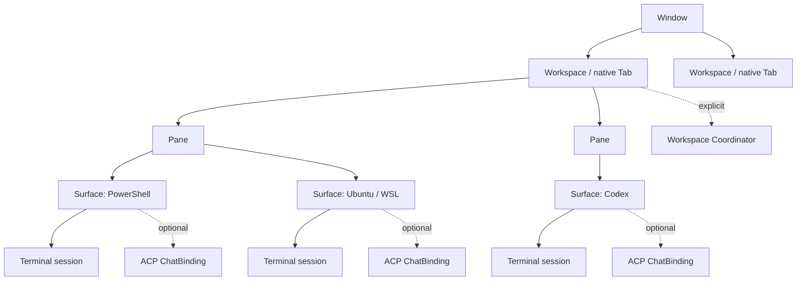

# Plano de implementação: workspaces, surfaces e agentes com escopo canônico

**Status:** implementação incremental em validação

**Repositório:** `intelligent-terminal`

**Branch observada ao elaborar o plano:** `feature/agent-workspace-launcher`

**Base observada:** `6635b61a9`

**Escopo:** criação heterogênea de terminais, ACP por surface, coordenação nativa de agentes, segurança e Chat Dock XAML

**Fora de escopo desta entrega:** WebView2 e compatibilidade com Claude Teams via shim `tmux`

> **Current source note (2026-07-30):** this plan's P0–P5 scope remains
> historical. Terminal Protocol is now 3.1, and a separate Browser Surface
> implementation was added after this native-chat delivery. WebView2 is not
> used by the Chat Pane. See
> [`../fork-architecture-and-status.md`](../fork-architecture-and-status.md).

## Registro de implementação (2026-07-26)

Este documento continua sendo a especificação e a Definition of Done. O estado
abaixo distingue código observado de gates que ainda exigem implementação ou
teste manual/real:

| Fase | Estado observado | Evidência | Lacuna que impede declarar completa |
|---|---|---|---|
| P0 | Implementado; E2E real pendente | `npx`/`.cmd`/path absoluto têm classificação e retry limitado; o `+` de surface duplica e o chevron projeta toda a árvore canônica de `newTabMenu`, incluindo pastas, perfis restantes/match, separadores e actions | Falta E2E com cache npm vazio e a UX opcional que combina perfil+direção de split num único dispatcher |
| P1 | Implementado; E2E real pendente | IDs de window/workspace/session/surface, `focus_generation`, `_meta.wta`, rejeição de foco atrasado e lifecycle `created/activated/closed/moved/detached` com snapshots imutáveis | Faltam E2E de drag/restore/multi-window e troca rápida durante streaming |
| P2 | Implementado no roteamento; persistência/E2E pendentes | Registro e routing são chaveados por scope de surface/workspace; foco e lifecycle isolam criação, ativação e fechamento sem misturar estado; o chat XAML troca de snapshot pelo scope exato | Restore/reconnect, detach grace period e backends SSH/WSL requerem E2E |
| P3 | Implementado no control plane | Equipes têm workspace ID, tasks, ownership atômico, heartbeat, retry, cancel/shutdown, auditoria e projeção/foco pela sidebar | O E2E real com dois agentes continua opt-in e não foi executado nesta rodada |
| P4 | Capability e eventos implementados; policy universal parcial | Terminal Protocol 3.0 valida HMAC de surface/workspace com subject/issuer/operações/expiração/nonce; ordinary ConPTY não herda host secret; queries/mutações/eventos são filtrados; Agent CLI perde token/CLSID; confirmações ACP `auto/prompt/deny` são impostas e testadas | WTA master ainda é host-admin; nonce não tem ledger de revogação/one-shot; faltam refresh, E2E hostil e confirmation/meta-confirm universal em protocol/team/settings |
| P5 | Implementado em contrato/build, sem WebView2; inspeção visual/E2E pendente | Header contextual, indicador “Seguindo”, mensagens, streaming, tool calls, permissões e composer são XAML; o chat acompanha exclusivamente a surface focada; Agents/Teams ficam na sidebar; snapshots monotônicos e actions exigem workspace+scope; en-US/pt-BR e UI Automation estão ligados | Faltam inspeção visual/high-contrast/Narrator e round trip real de streaming/permissão com adapter autenticado |

Nenhuma lacuna acima deve ser convertida em alegação de E2E. Builds e testes
automatizados comprovam contratos locais; os gates visuais, com adapters reais,
rede, credenciais, restore e múltiplas janelas permanecem separados.

## 1. Objetivo

Transformar a fork em um terminal nativo para trabalho simultâneo com shells e
agentes, sem manter duas hierarquias concorrentes de tabs/workspaces e sem
perder as funções maduras herdadas do Windows Terminal.

Ao final:

1. uma tab nativa do Windows Terminal representa um **Workspace**;
2. cada divisão visual do workspace é um **Pane**;
3. cada sessão empilhada dentro de um pane é uma **Surface**;
4. cada surface pode usar qualquer perfil disponível, e não apenas clonar o
   perfil que abriu o workspace;
5. o chat ACP padrão pertence à surface ativa;
6. coordenação de vários agentes ocorre somente quando o usuário escolhe o
   escopo de workspace ou equipe;
7. permissões são impostas no servidor, não apenas exibidas pela interface;
8. toda a experiência nova usa XAML/WinUI e componentes nativos, sem WebView2.

O plano mantém as capacidades nativas de perfis, cores, menus, splits,
movimentação entre janelas, restauração e configuração. A fork deve adicionar
sem reimplementar esses conceitos em estruturas paralelas.

## 2. Evidência atual e problema a resolver

### 2.1 Hierarquia observada

O produto já contém três níveis úteis:

| Conceito atual | Conceito canônico | Responsabilidade |
|---|---|---|
| Tab nativa do Windows Terminal | Workspace | Agrupa uma tarefa/projeto e seu layout |
| Região criada por split | Pane | Define uma área simultaneamente visível |
| Sessão empilhada no pane | Surface | Executa um shell ou agente individual |

Essa hierarquia deve ser adotada como única fonte da verdade. A sidebar será
uma projeção dos workspaces nativos; não criará um segundo tipo de workspace.

### 2.2 Limitação de criação de terminais

Há dois comportamentos diferentes:

- o botão `+` de Workspaces usa o menu canônico de perfis e permite PowerShell,
  Command Prompt, WSL, SSH, Azure Cloud Shell e perfis personalizados;
- o botão `+` dentro do pane chama `_OpenNewSurface(targetPane)`, que copia os
  argumentos da surface ativa, incluindo perfil, comando e diretório.

Clonar a surface atual é útil e deve continuar rápido, mas não pode ser a única
opção. Um workspace deve poder conter, por exemplo:

- PowerShell local para comandos gerais;
- Ubuntu/WSL para build;
- uma conexão SSH;
- Codex em uma surface;
- outro agente em outra surface.

### 2.3 Limitação do Chat Pane/ACP

O Chat Pane atual é associado à tab nativa inteira. Quando o foco muda entre
panes ou surfaces, o contexto pode acompanhar o terminal ativo, mas a conversa
ACP continua compartilhada. Isso não oferece o isolamento esperado entre
Codex, outro agente e shells diferentes.

Também foi observado um defeito de inicialização do `codex-acp` por `npx`:

- a classificação de processo lento reconhece nomes literais como `npx`;
- um executável resolvido como `C:\Program Files\nodejs\npx.cmd` não entra
  nessa classificação;
- o processo recebe um timeout curto, incompatível com o primeiro download ou
  cache frio;
- o `codex-acp` 1.1.7 funciona quando iniciado diretamente.

### 2.4 Estado do checkout

No momento desta especificação há 59 entradas rastreadas modificadas e 18
entradas não rastreadas. Antes de mudanças arquiteturais, é obrigatório criar
um checkpoint revisável e reproduzível. Nenhuma fase pode usar uma limpeza
destrutiva do checkout como atalho.

## 3. Terminologia e invariantes

### 3.1 Modelo canônico



### 3.2 Invariantes

1. **Workspace é a tab nativa.** Não existe coleção paralela com lifecycle
   independente.
2. **Pane é layout.** Pane não é automaticamente uma conversa nem um agente.
3. **Surface é a unidade de sessão.** Perfil, CWD, terminal, agente e conversa
   são resolvidos por surface.
4. **Foco não é propriedade.** Mudar o foco seleciona um binding; não transfere
   uma conversa de uma surface para outra.
5. **IDs são estáveis.** Um ID não é reutilizado durante a vida da janela.
6. **Perfil vem do modelo canônico do Windows Terminal.** WSL, SSH, Azure,
   perfis dinâmicos, personalizados e `newTabMenu` não serão copiados para uma
   lista mantida pela fork.
7. **Coordenação é explícita.** O chat de uma surface não passa a controlar
   outras surfaces por estar no mesmo workspace.
8. **Autorização ocorre no boundary que executa a ação.** A UI não é uma
   barreira de segurança.
9. **Um agente pode ter várias sessões ACP.** Uma nova surface não deve,
   automaticamente, iniciar outra cópia pesada do mesmo processo.
10. **Restauração preserva identidade lógica.** Layout, perfil e associação de
    chat podem ser restaurados, mas processos e tokens nunca são assumidos como
    ainda válidos sem revalidação.

## 4. Contratos de estado

Os nomes finais podem seguir as convenções C++/WinRT e Rust do repositório, mas
os contratos precisam conter estas informações.

### 4.1 `FocusContext`

```text
window_id
workspace_id
pane_id
surface_id
terminal_session_id
focus_generation
```

- `focus_generation` aumenta a cada mudança e impede respostas atrasadas de
  atualizar o painel errado;
- todos os campos são explícitos; não se infere surface somente pela tab ativa;
- eventos de foco carregam o snapshot completo.

### 4.2 `SurfaceDescriptor`

```text
surface_id
pane_id
workspace_id
profile_guid
profile_name
connection_type
cwd
commandline
terminal_session_id
lifecycle_state
created_at
```

`connection_type` deve distinguir pelo menos local, WSL, SSH, Azure/Cloud e
outros providers. Isso é necessário para não apresentar um agente local como
se estivesse operando dentro de uma sessão remota.

### 4.3 `ChatBinding`

```text
binding_id
surface_id
agent_id
model
acp_session_id
effective_cwd
backend
permission_profile
binding_mode
lifecycle_state
last_activity
```

Valores iniciais para `binding_mode`:

- `acp-companion`: chat ACP associado à surface;
- `terminal-agent`: agente executado diretamente no terminal;
- `plain-shell`: sem chat associado;
- `team-worker`: worker registrado no coordenador.

### 4.4 `WorkspaceCoordinatorBinding`

```text
coordinator_id
workspace_id
team_id
agent_id
acp_session_id
worker_ids
permission_profile
lifecycle_state
```

O coordenador é diferente do chat de uma surface. Ele não aparece como escopo
selecionável no Chat Dock: coordenação e equipes usam entradas operacionais
explícitas na sidebar, enquanto o chat sempre acompanha o terminal focado.

### 4.5 `CreationRequest`

```text
target:
  Workspace
  Surface(pane_id)
  SplitPane(pane_id, direction)

source:
  DuplicateCurrent
  SelectedProfile(profile_guid)
  Action(new_terminal_args)

cwd_policy:
  InheritCurrent
  ProfileDefault
  Explicit(path)
```

O menu escolhe `source`; o destino escolhe `target`. Essa separação permite
reutilizar o sistema nativo de perfis sem duplicar a lista.

## 5. Jornadas obrigatórias

### 5.1 Workspace heterogêneo

1. O usuário cria um workspace PowerShell.
2. No pane ativo, o clique principal no `+` duplica PowerShell e o CWD.
3. A seta do mesmo botão abre a lista canônica de perfis.
4. O usuário escolhe Ubuntu/WSL.
5. A nova surface abre no mesmo pane e torna-se ativa.
6. O usuário abre o menu de split e escolhe SSH à direita.
7. O novo pane abre uma conexão SSH independente.
8. Sidebar, switcher e acessibilidade identificam os três ambientes.

### 5.2 Conversa isolada por surface

1. A surface PowerShell associa-se ao Codex ACP e inicia uma conversa.
2. A surface WSL associa-se ao mesmo adapter de agente, mas recebe outra sessão
   ACP e o backend compatível com WSL.
3. A troca de foco alterna o conteúdo do Chat Dock sem misturar histórico.
4. Uma resposta ainda em streaming continua vinculada à surface de origem.
5. Fechar a surface oferece encerrar, manter para restauração ou desacoplar a
   sessão conforme a política configurada.

### 5.3 Coordenação de workspace

1. O usuário abre `Agentes e equipes` pela sidebar.
2. A UI apresenta workers e estado de coordenação sem alterar o Chat Dock.
3. O usuário registra workers existentes ou cria workers pelo template.
4. O control plane cria tarefas com ID, owner, estado, heartbeat e resultado.
5. Abrir um agente ou tarefa foca sua surface; o Chat Dock então acompanha
   automaticamente aquela conversa.
6. Retry e shutdown são explícitos, auditáveis e sujeitos à política.

### 5.4 Falha e recuperação

1. O cache de `npx` está frio.
2. A interface mostra `Starting agent` durante o timeout apropriado.
3. Uma falha transitória recebe no máximo uma tentativa automática controlada.
4. Persistindo o erro, a UI mostra causa, comando/adapter sanitizado e `Retry`.
5. Reiniciar o app restaura layout e bindings, revalida processos e carrega
   sessões ACP de forma preguiçosa.

### 5.5 Operação sensível

1. Um agente de uma surface tenta operar em outro pane ou workspace.
2. O servidor resolve o capability token e a política efetiva.
3. Sem permissão, a ação é negada ou solicita confirmação.
4. A confirmação mostra origem, destino, operação e duração da concessão.
5. A decisão e o resultado entram no log de auditoria sem conteúdo sensível.

## 6. UX de criação e unificação de menus

### 6.1 Matriz de comportamento

| Ponto de entrada | Clique principal | Menu/chevron | Resultado |
|---|---|---|---|
| `+` em Workspaces | Novo workspace com perfil padrão | Perfis e ações do `newTabMenu` | Nova tab nativa |
| `+` no cabeçalho do pane | Duplicar surface e CWD atuais | Novo terminal com perfil... | Nova surface no pane |
| Split Pane | Split duplicando a surface atual | Perfil + direção | Novo pane |
| Command Palette | Ação selecionada | Perfil/destino quando aplicável | Mesmo dispatcher |
| Atalho | Ação explícita | N/A | Mesmo dispatcher |

### 6.2 Atalhos propostos

- `Ctrl+Alt+T`: duplicar a surface atual;
- `Ctrl+Alt+Shift+T`: abrir o seletor de perfil para nova surface;
- manter os atalhos nativos/configurados de split;
- expor na Command Palette:
  - `New workspace with profile...`;
  - `New surface with profile...`;
  - `Split pane with profile...`;
  - `Duplicate current surface`.

Os atalhos são defaults propostos e precisam passar pela verificação de
conflitos no action map antes de serem fixados.

### 6.3 Fonte canônica de perfis

Extrair ou generalizar o builder usado por
`TerminalPage::_CreateNewTabFlyoutProfile` para receber o destino da criação.
Ele deve continuar respeitando:

- perfis estáticos e dinâmicos;
- `matchProfiles` e `remainingProfiles`;
- pastas e separadores de `newTabMenu`;
- actions configuradas;
- ícones, nomes localizados e perfis ocultos;
- WSL, SSH, Azure Cloud Shell e profiles personalizados.

Não será mantida uma segunda enumeração de perfis em
`SurfaceStackPaneContent`.

### 6.4 Política de CWD

- **Duplicate current:** herda CWD quando o provider suporta herança segura;
- **Selected profile:** usa o diretório padrão do perfil;
- **Shift/modificador configurado:** pode solicitar herança do CWD;
- **SSH/Azure:** sempre cria uma conexão independente; não presume que o CWD
  local seja válido no host remoto;
- **WSL:** converte o caminho somente por mecanismo já suportado e testado; na
  ausência dele, usa o default do perfil.

### 6.5 Acessibilidade

- nome acessível distinto para o botão principal e a seta;
- navegação completa por teclado;
- foco retorna para a nova surface;
- leitor de tela anuncia perfil, destino e sucesso/falha;
- menus mantêm localização e high contrast;
- seleção de escopo do Chat Dock nunca depende apenas de cor ou ícone.

## 7. Estratégia de entrega

As fases têm dependências explícitas. Uma fase somente termina quando seus
critérios de aceite e gates de regressão passam.

### Gate 0 — Checkpoint reproduzível

#### Resultado

Separar com segurança o estado já implementado das próximas mudanças.

#### Entregas

- inventário dos 59 arquivos rastreados modificados e 18 entradas não
  rastreadas;
- classificação: produto, teste, documento, artefato gerado e arquivo do
  usuário;
- build e testes atuais registrados antes de alterar a arquitetura;
- snapshot das configurações de teste, sem credenciais;
- commit/checkpoint revisado em branch própria, quando isso for autorizado;
- manifesto com commit base, toolchain, versões de Rust, MSBuild, Windows SDK,
  Node e adapters ACP;
- lista explícita de falhas já existentes.

#### Gate

- outro checkout consegue reproduzir o build a partir do checkpoint;
- nenhum arquivo do usuário ou configuração local é incorporado;
- falhas de baseline são distinguidas de regressões futuras.

---

## P0 — Confiabilidade do adapter e criação canônica de terminais

P0 resolve os dois bloqueios mais imediatos sem alterar ainda o ownership das
sessões ACP.

### P0-A — Inicialização confiável de `npx`/`codex-acp`

#### Entregas

1. Normalizar o comando do adapter antes de classificar o launcher:
   - nome literal;
   - path absoluto;
   - basename sem extensão;
   - wrappers `.cmd`, `.bat` e equivalentes suportados.
2. Aplicar timeout de cold start a `npx`, independentemente de o executável ter
   sido resolvido para um path absoluto.
3. Separar timeouts de:
   - spawn;
   - handshake ACP;
   - primeira resposta;
   - operação normal.
4. Permitir uma única tentativa automática para falha classificada como
   transitória, com backoff curto e cancelável.
5. Exibir estado `Starting`, `Retrying`, `Failed` e `Ready`.
6. Oferecer `Retry` manual sem recriar a tab ou o workspace.
7. Manter a opção de prefetch/cache do adapter como otimização, nunca como
   requisito invisível.
8. Sanitizar paths, argumentos e ambiente em logs e mensagens.

#### Testes

- `npx`, `npx.cmd` e path absoluto classificam-se igualmente;
- cache npm vazio;
- cache aquecido;
- adapter ausente;
- processo inicia, mas não faz handshake;
- cancelamento durante download/handshake;
- retry não cria dois processos concorrentes;
- `codex-acp` 1.1.7 executa `initialize`, `session/new` e `session/list`.

#### Aceite

- o primeiro start não falha pelo timeout curto atual;
- uma falha terminal deixa causa e ação recuperável;
- nenhum retry infinito ou processo órfão é criado.

### P0-B — Surface e split com qualquer perfil

#### Entregas

1. Introduzir o dispatcher de `CreationRequest`.
2. Generalizar o menu canônico de perfis para os três destinos:
   Workspace, Surface e SplitPane.
3. Converter o `+` do pane em `SplitButton`:
   - principal: Duplicate current surface;
   - chevron: New surface with profile...
4. Adicionar perfil e direção ao menu de split.
5. Encaminhar Command Palette, menus de contexto e atalhos ao mesmo dispatcher.
6. Preservar customização nativa, profile GUID, icon, title, color e
   `newTabMenu`.
7. Atualizar strings localizadas e accessibility names.

#### Testes

- criar uma surface com perfil diferente no mesmo pane;
- duplicar mantém o perfil e CWD atuais;
- perfil selecionado usa o CWD default;
- split com cada direção e perfil;
- perfis dinâmicos e menu personalizado;
- perfil removido entre abertura e seleção falha de modo recuperável;
- high contrast, teclado e leitor de tela;
- nenhuma regressão em `newTab` e `splitPane` nativos.

#### Aceite

- PowerShell, WSL e um perfil personalizado coexistem em um workspace;
- a lista exibida é a mesma fonte usada pelo menu nativo;
- criar surface não cria outro workspace na sidebar.

---

## P1 — Identidade e foco canônicos

### Resultado

Toda operação sabe exatamente qual window, workspace, pane, surface e sessão
terminal originou o evento.

### Entregas

1. Definir IDs estáveis para:
   - window;
   - workspace/tab;
   - pane;
   - surface;
   - terminal session.
2. Adicionar `surface_id` ao contexto hoje carregado por pane.
3. Propagar `FocusContext` por:
   - C++/WinRT;
   - IDL/COM;
   - JSON/protocolo auxiliar;
   - `wtcli`;
   - helper/master do `wta`;
   - `_meta.wta` das chamadas ACP.
4. Publicar eventos:
   - `surface_created`;
   - `surface_activated`;
   - `surface_closed`;
   - `surface_moved`;
   - `focus_changed`.
5. Anexar `focus_generation` às atualizações assíncronas.
6. Versionar o protocolo e suportar detecção clara de cliente antigo.
7. Persistir o mapeamento necessário à restauração sem persistir handles
   efêmeros.
8. Definir comportamento de drag/move de tab entre janelas:
   - workspace mantém identidade lógica;
   - window_id muda;
   - bindings são revalidados;
   - eventos antigos da janela anterior são ignorados.

### Decisão obrigatória P1-D1

Escolher o formato do `surface_id`. Recomendação: GUID gerado no host, persistido
com o layout e nunca derivado de índice visual. Índices mudam com close, move e
restore e não são identidade segura.

### Testes

- alternar surfaces rapidamente durante streaming;
- fechar a surface ativa;
- mover workspace entre janelas;
- restaurar sessão;
- split/unsplit;
- múltiplas janelas;
- evento atrasado com geração antiga;
- compatibilidade de versão do protocolo.

### Aceite

- logs correlacionam uma ação ao caminho completo sem ambiguidade;
- nenhuma resposta de uma surface aparece em outra após troca rápida;
- IDs não são reutilizados durante a vida da aplicação.

---

## P2 — Sessão ACP isolada por surface

### Resultado

Cada surface possui uma conversa ACP independente, usando processos
compartilhados quando o adapter permitir.

### Entregas

1. Criar um `SurfaceSessionRegistry` cuja chave primária é `surface_id`.
2. Separar:
   - processo do agente/adapter;
   - conexão ACP;
   - sessão ACP;
   - binding de UI.
3. Compartilhar o processo do mesmo adapter por boundary seguro e manter
   múltiplas sessões ACP dentro dele.
4. Resolver herança de configuração:
   - global default;
   - override do workspace;
   - override da surface.
5. Ao mudar o foco:
   - salvar o binding atual;
   - resolver o binding da nova surface;
   - renderizar imediatamente o estado conhecido;
   - carregar/reconectar de modo lazy;
   - aceitar atualizações somente com IDs e geração correspondentes.
6. Oferecer ações por surface:
   - Attach agent;
   - Change agent/model;
   - New chat;
   - Resume chat;
   - Detach chat;
   - Stop agent.
7. Distinguir `terminal-agent` de `acp-companion`. Detectar Codex rodando dentro
   do terminal não autoriza assumir ou sequestrar sua sessão.
8. Resolver backend pelo ambiente da surface:
   - local Windows;
   - WSL/distro;
   - SSH;
   - cloud/custom.
9. Não anunciar ACP remoto em SSH/Azure quando o adapter continua local.
10. Restaurar bindings de forma lazy após reinício.

### Migração do modelo por tab

Recomendação:

- a conversa ACP existente da tab torna-se o
  `WorkspaceCoordinatorBinding` legado;
- não associá-la arbitrariamente à surface que estiver ativa durante o upgrade;
- surfaces começam sem binding ou recebem um binding novo quando o usuário
  inicia o chat;
- mostrar uma ação explícita `Move legacy chat to this surface`.

Isso evita que uma conversa histórica passe silenciosamente a controlar apenas
um dos terminais.

### Política de processos

- não criar um helper pesado por surface;
- manter um router por workspace/janela durante a transição;
- manter pool por adapter/backend quando o protocolo permitir;
- encerrar processos sem bindings ativos após período configurável;
- medir memória e handles antes de escolher defaults.

### Testes

- duas surfaces, mesmo adapter, duas sessões;
- dois adapters diferentes;
- uma surface sem agente;
- alternância durante tool call;
- stop de uma sessão não encerra as demais;
- falha do processo compartilhado marca todos os bindings afetados;
- reconnect restaura apenas sessões válidas;
- WSL seleciona o backend correto;
- SSH não é rotulado como ACP remoto sem evidência.

### Aceite

- o histórico nunca vaza entre surfaces;
- trocar de foco troca o chat exibido e o scope breadcrumb;
- o número de processos não cresce linearmente sem necessidade;
- fechar uma surface aplica a política escolhida sem órfãos.

---

## P3 — Workspace Coordinator e equipes nativas

### Resultado

O usuário coordena vários agentes de um workspace por primitivas nativas do
`wta`, sem Claude Teams e sem shim `tmux`.

### Entregas

1. Tratar `wta team` como control plane canônico.
2. Integrar o `team_id` ao `workspace_id`.
3. Formalizar o protocolo de tarefa:
   - `task_id`;
   - descrição;
   - owner;
   - dependências;
   - estado;
   - heartbeat;
   - tentativa;
   - resultado;
   - erro;
   - timestamps;
   - shutdown acknowledgment.
4. Exibir na sidebar:
   - workers;
   - surface associada;
   - estado;
   - tarefa;
   - atenção necessária;
   - heartbeat.
5. Expor no Coordinator:
   - dispatch;
   - inspect;
   - focus;
   - message;
   - retry;
   - cancel;
   - shutdown.
6. Implementar ownership atômico e impedir dupla atribuição acidental.
7. Definir timeout/lease e reatribuição auditável.
8. Permitir worker sem UI visível, mas sempre com identidade e ação para
   inspecionar.
9. Diferenciar sessão interativa, worker de equipe e coordinator.
10. Adicionar um E2E real com pelo menos dois agentes instalados, marcado como
    opt-in quando depender de credenciais ou rede.

### Gate de segurança

P3 pode entregar observabilidade read-only antes de P4. Dispatch, retry,
cancel, mensagens cross-surface e shutdown não podem ficar habilitados por
default até que o enforcement de capabilities de P4 esteja ativo.

### Testes

- dois workers e duas tarefas independentes;
- disputa pelo mesmo task;
- heartbeat perdido;
- retry preserva histórico de tentativas;
- worker fechado durante execução;
- reinício do coordinator;
- shutdown normal e forçado;
- foco leva à surface correta;
- coordinator de um workspace não opera outro sem autorização.

### Aceite

- status da sidebar deriva do control plane, não de inferência visual;
- cada mutação possui origem, target e resultado;
- nenhuma tarefa fica simultaneamente owned por dois workers;
- E2E real é reportado separadamente de mocks/contract tests.

---

## P4 — Segurança e enforcement de permissões

### Resultado

Permissões de agentes tornam-se uma propriedade verificável do servidor.

### Entregas

1. Definir capability token por binding/surface, com:
   - subject;
   - workspace;
   - surface;
   - operações permitidas;
   - expiração;
   - nonce;
   - issuer.
2. Validar capability no COM server/helper antes de executar.
3. Definir classes de operação:
   - leitura da surface atual;
   - input na surface atual;
   - criação de surface/pane;
   - leitura de outro pane;
   - input em outro pane;
   - operação cross-workspace;
   - coordenação/team mutation;
   - mudança de política.
4. Implementar de fato `aiIntegration.confirmation.*`.
5. Manter defaults conservadores até o enforcement estar comprovado.
6. Exigir meta-confirmação para relaxar uma política durante uma ação.
7. Remover/sanitizar capacidades herdadas como `WT_COM_CLSID` em processos que
   não devem controlar o host.
8. Mostrar preview de contexto antes de anexar conteúdo de outro scope.
9. Redigir secrets, tokens e ambiente de logs/telemetria.
10. Registrar auditoria por IDs, ação, decisão e resultado, sem transcript por
    default.
11. Especificar diferenças de trust para local, WSL, SSH e cloud.
12. Falhar fechado quando identidade, versão ou capability forem inválidas.

### Matriz mínima de política

| Operação | Mesma surface | Outro pane | Outro workspace |
|---|---|---|---|
| Ler metadados básicos | Allow | Prompt/Policy | Deny/Prompt |
| Ler buffer/contexto | Policy | Prompt | Deny |
| Enviar input | Prompt/Policy | Prompt | Deny/Prompt explícito |
| Criar surface/pane | Prompt/Policy | N/A | N/A |
| Dispatch de task | N/A | Coordinator policy | Coordinator policy |
| Mudar permissões | Meta-confirm | Meta-confirm | Meta-confirm |

Os valores finais são configuráveis apenas dentro dos limites impostos pelo
modelo de segurança.

### Testes adversariais

- capability ausente, expirada, alterada e reutilizada;
- helper de outra window;
- ID válido com surface já fechada;
- cross-workspace sem consentimento;
- downgrade de protocolo;
- variável COM herdada indevidamente;
- prompt spoofing por título do terminal;
- corrida entre confirmação e mudança de foco;
- logs não contêm tokens ou conteúdo.

### Aceite

- desabilitar a UI não contorna a política;
- uma ação negada não chega ao terminal;
- confirmações identificam origem e destino estáveis;
- todos os settings anunciados têm teste de enforcement.

---

## P5 — Chat Dock e experiência final nativa

### Resultado

Uma interface XAML única torna claros foco, escopo, agente e estado, sem
WebView2.

### Entregas

1. Substituir a ideia de Chat Pane fixo por um Chat Dock reutilizável.
2. Permitir dock à direita e, se viável com o layout nativo, inferior.
3. Cabeçalho contextual com:
   - agente/backend;
   - indicador passivo `Seguindo`;
   - profile e working directory visíveis;
   - workspace, pane e surface mantidos no nome de automação acessível.
4. Não mostrar seletor de escopo. O Chat Dock acompanha exclusivamente a
   surface focada; Coordinator e Team/Fleet são experiências operacionais
   separadas na sidebar.
5. Mostrar:
   - agente;
   - modelo;
   - conexão;
   - sessão;
   - working directory;
   - permissões;
   - estado/erro/retry.
6. Renderizar streaming, tool calls, confirmações e resultados com controles
   nativos.
7. Integrar sidebar:
   - título orientado a projeto/tarefa;
   - profiles/environments presentes;
   - agents/workers;
   - status e atenção necessária;
   - cor de workspace aplicada à área inteira do card com contraste adequado.
8. Preservar menus de contexto nativos, inclusive rename, color, duplicate,
   split, move, close e ações de workspace.
9. Oferecer switcher de surfaces dentro do pane sem competir com a sidebar de
   workspaces.
10. Completar localização, high contrast, UI Automation e teclado.

### Política de títulos

Prioridade recomendada:

1. nome definido pelo usuário;
2. projeto/repositório detectado;
3. diretório de trabalho;
4. nome do perfil inicial.

O workspace deixa de ser chamado de “PowerShell” apenas porque esse foi o
primeiro perfil. Perfis ativos aparecem como metadados/badges.

### Aceite

- o usuário identifica visualmente qual terminal o chat está seguindo;
- trocar de surface atualiza contexto e chat sem piscar/recriar o dock;
- não existe seletor Surface/Workspace/Team no fluxo de conversa;
- cores continuam úteis e acessíveis;
- nenhuma tela exige WebView2;
- não há tabs/workspaces duplicados com lifecycles concorrentes.

## 8. Mapa de componentes afetados

O mapa é orientativo. A implementação deve confirmar ownership antes de editar.

| Área | Componentes principais | Mudança esperada |
|---|---|---|
| Surface UI | `SurfaceStackPaneContent.*` | SplitButton, profile picker, IDs e eventos |
| Criação | `TabManagement.cpp`, `TerminalPage.cpp` | Dispatcher por destino e fonte canônica |
| Args do terminal | `TerminalPaneContent.*` | Duplicate vs selected profile e CWD policy |
| Shell/UI | `TerminalPage.xaml`, `.h`, `.cpp` | Chat Dock, scope, focus e menus |
| Sidebar | `WorkspaceSidebar.cpp` | Projeção dos workspaces, team/status/badges |
| Protocolo host | `TerminalPage.Protocol.cpp`, IDLs, COM server | IDs, lifecycle, capabilities |
| ACP context | `tools/wta/src/pane_context.rs` | `FocusContext` completo |
| ACP spawn | `tools/wta/src/protocol/acp/spawn.rs` | Detecção de wrapper, timeout e retry |
| ACP sessions | `session_registry.rs`, `client.rs`, `master/mod.rs` | Registry por surface e pool por adapter |
| Teams | `tools/wta/src/team.rs` | Tasks, ownership, heartbeat e lifecycle |
| Settings | modelos/editor de settings | Overrides, confirmations e feature flags |
| Docs | `doc/agent-workspaces.md`, `doc/native-agent-teams.md`, `doc/security-model.md` | Contrato público atualizado |
| Release | `doc/release-check-list.md` | Gates P0–P5 |

## 9. Estratégia de testes

### 9.1 Pirâmide

#### Unitários C++/WinRT

- dispatch de `CreationRequest`;
- construção do menu por target;
- duplicate vs selected profile;
- lifecycle e serialização de IDs;
- geração de foco;
- contraste da cor calculada.

#### Unitários Rust

- normalização/classificação de executável;
- timeout/retry;
- registry por surface;
- multiplexação de sessões;
- team ownership/lease;
- capabilities e decisões de política;
- redaction.

#### Contract tests

- C++/COM/JSON/Rust usam o mesmo schema;
- versões incompatíveis falham claramente;
- `_meta.wta` carrega o caminho de IDs completo;
- eventos fora de ordem não alteram o binding ativo.

#### E2E determinístico local

1. Workspace PowerShell + surface de perfil sintético diferente.
2. Duplicate herda CWD; selected profile usa default.
3. Split à direita com perfil diferente.
4. `newTabMenu` customizado continua válido.
5. Duas surfaces, duas sessões ACP mock, sem vazamento.
6. Troca rápida durante streaming.
7. Move de workspace entre janelas.
8. Restart e restore.
9. Operação cross-pane negada e depois confirmada.
10. Cache npm vazio com adapter de teste controlado.

#### E2E real opt-in

- `codex-acp` instalado e autenticado;
- Codex + segundo agente instalado para team;
- WSL real;
- SSH real somente em ambiente isolado de teste;
- Azure Cloud Shell somente com consentimento/credenciais de teste.

Resultados opt-in devem ser reportados separadamente. Gate pulado nunca conta
como sucesso observado.

### 9.2 Regressões nativas obrigatórias

- new tab e menus de perfil;
- tab color, rename, pin e close;
- split/resize/move;
- drag de tab entre janelas;
- panes com múltiplas surfaces;
- settings reload;
- dynamic profiles;
- command palette;
- high contrast;
- restauração de sessão;
- windowing e packaged identity.

### 9.3 Metas provisórias de desempenho

Validar e ajustar após o baseline:

- trocar o binding visual de surface não bloqueia a UI;
- nenhuma cópia extra do adapter por surface quando multiplexação é suportada;
- nenhum crescimento de processo/handle após ciclos repetidos de
  create/close;
- cold start usa timeout específico e progresso visível;
- warm start não recebe artificialmente o timeout longo antes de reportar erro.

Não fixar SLA numérico de release antes das medições de Gate 0.

## 10. Validação por fase

Usar a toolchain documentada pelo repositório e registrar saída completa. O
conjunto mínimo inclui:

1. formatação e testes Rust de `tools/wta`;
2. build Rust explícito para `x86_64-pc-windows-msvc`;
3. build do Terminal pelo ambiente `razzle`/MSBuild;
4. testes unitários das áreas alteradas;
5. Pester/E2E direcionado;
6. smoke test da build empacotada;
7. inspeção visual em 100%, 125% e 150% de escala;
8. keyboard-only e high contrast;
9. teste multi-window;
10. verificação de processos/handles após fechamento.

Cada relatório deve separar:

- **observado:** executado nesta build;
- **suportado:** comprovado por teste de contrato/unidade;
- **refutado:** falhou;
- **não verificado:** depende de ambiente, credencial ou gate opt-in.

## 11. Migração, feature flags e rollback

### 11.1 Flags

Introduzir flags temporárias e removê-las após estabilização:

- `surfaceProfilePicker`;
- `canonicalFocusContext`;
- `surfaceScopedAgentSessions`;
- `workspaceCoordinator`;
- `enforcedAiPermissions`;
- `nativeChatDock`.

### 11.2 Ordem de habilitação

1. P0 profile picker e reliability em dev build;
2. P1 IDs em shadow mode, comparando roteamento antigo e novo;
3. P2 por opt-in, com fallback ao Chat Pane por tab;
4. P3 read-only;
5. P4 enforcement;
6. P3 mutations;
7. P5 Chat Dock default;
8. remover o roteamento legado somente após migração e telemetria local.

### 11.3 Persistência e upgrade

- schema de layout/bindings recebe versão;
- dados desconhecidos são preservados quando possível;
- versão antiga ignora campos novos sem corromper configuração;
- sessão ACP inválida vira `Needs reconnect`, não é recriada silenciosamente;
- rollback mantém o layout terminal mesmo que não entenda os bindings novos.

### 11.4 Rollback

Cada fase deve ser revertível pela flag sem:

- apagar workspaces;
- alterar `settings.json` irreversivelmente;
- perder histórico ACP persistido;
- deixar helpers/processos em execução;
- exigir reset da configuração do usuário.

## 12. Observabilidade e diagnóstico

### Eventos mínimos

- surface lifecycle;
- focus changed;
- binding resolved;
- adapter spawn/handshake/retry/failure;
- ACP session create/load/close;
- team task lifecycle;
- capability decision;
- restore/migration.

### Campos de correlação

Usar IDs opacos e geração de foco. Não registrar:

- prompt/transcript por default;
- conteúdo do terminal;
- tokens;
- environment completo;
- argumentos sensíveis;
- hostname remoto quando não necessário.

Adicionar comando/ação de diagnóstico que produza um bundle sanitizado com
versões, estados, IDs hasheados e falhas recentes.

## 13. Riscos e mitigação

| Risco | Impacto | Mitigação/gate |
|---|---|---|
| Checkout amplo e não consolidado | Regressão difícil de atribuir | Gate 0 obrigatório |
| IDs baseados em índice visual | Cross-routing após move/close | GUID estável + testes multi-window |
| Processo ACP por surface | Memória e startup excessivos | Pool por adapter + sessões multiplexadas |
| Evento assíncrono atrasado | Resposta no chat errado | `focus_generation` + IDs completos |
| Lista de perfis duplicada | Drift de WSL/SSH/custom | Builder canônico por target |
| CWD local aplicado a remoto | Comando inválido/confuso | `cwd_policy` por provider |
| UI de segurança sem enforcement | Bypass trivial | P4 no servidor; fail closed |
| P3 mutável antes de P4 | Controle cross-surface inseguro | Read-only até security gate |
| Migração de chat por tab arbitrária | Histórico ligado à surface errada | Migrar para coordinator legado |
| Adapter frio via npm | Falha intermitente | P0 timeout por launcher + retry controlado |
| Drag entre janelas | Binding órfão | lifecycle explícito + revalidação |
| SSH aparentar ACP remoto | Falsa expectativa de acesso | backend label e capability explícitos |
| Customização nativa perdida | Fork difícil de manter | reutilizar actions/settings/menu nativos |

## 14. Decisões arquiteturais a registrar

Criar ADRs curtos antes ou junto da fase correspondente:

1. **ADR-001 — Native Tab is Workspace.**
2. **ADR-002 — Surface is the default ACP chat scope.**
3. **ADR-003 — Stable host-issued IDs and focus generations.**
4. **ADR-004 — Canonical profile menu with destination dispatch.**
5. **ADR-005 — Shared adapter process with multiple ACP sessions.**
6. **ADR-006 — Legacy tab chat migrates to workspace coordinator.**
7. **ADR-007 — Server-enforced capabilities.**
8. **ADR-008 — Native XAML Chat Dock; no WebView2.**

### Decisões ainda abertas e default recomendado

| Decisão | Default recomendado | Prazo máximo |
|---|---|---|
| Formato de `surface_id` | GUID do host persistível | Antes de P1 |
| Router por window ou workspace | Workspace no início; medir consolidação por window | Antes de P2 |
| Persistência de transcript | Adapter/session store, não duplicar no terminal | Antes de P2 |
| ACP em SSH | Local companion claramente rotulado; remoto só por adapter explícito | Antes de P2 |
| CWD ao escolher perfil | Default do perfil | P0-B |
| Chat legado por tab | Workspace Coordinator legado | Antes da migração P2 |
| Lifetime de sessão fechada | Configurável, default detach + grace period | Antes de P2 |
| Posição do dock | Direita como default | Antes de P5 |

## 15. Itens explicitamente adiados

Estes itens não bloqueiam P0–P5 e não devem entrar silenciosamente no escopo:

- WebView2 e superfícies web;
- importação de cookies/sessões de navegador;
- Claude Teams ou compatibilidade por shim `tmux`;
- coordenação cross-machine;
- ACP remoto automático sobre qualquer SSH;
- marketplace de adapters/plugins;
- sincronização de workspaces na nuvem;
- controle implícito de um agente terminal já em execução;
- Fleet global entre vários workspaces, além do contrato mínimo necessário à
  extensão futura;
- publicação externa, assinatura ou distribuição ampla da build.

Cada adiamento precisa de uma proposta separada com threat model e critérios de
aceite próprios.

## 16. Definition of Done geral

A iniciativa está completa quando:

- [ ] a hierarquia Window → Workspace → Pane → Surface é única e documentada;
- [ ] workspace, surface e split aceitam qualquer perfil canônico aplicável;
- [ ] duplicate current continua disponível em um clique;
- [ ] cada surface possui binding ACP independente;
- [ ] trocar foco nunca mistura histórico ou resultado;
- [ ] coordinator é explicitamente diferente do chat da surface;
- [ ] `wta team` controla tasks, ownership, heartbeat, retry e shutdown;
- [ ] mutações cross-surface passam por capabilities impostas no servidor;
- [ ] settings de confirmação são efetivamente testados;
- [ ] Chat Dock XAML mostra scope, agente, backend e permissão;
- [ ] sidebar projeta tabs nativas e não duplica lifecycle;
- [ ] restauração e multi-window passam;
- [ ] perfis dinâmicos/customizados continuam funcionando;
- [ ] o cold start de `codex-acp` funciona com cache npm vazio;
- [ ] não há processos/helpers órfãos;
- [ ] documentação, release checklist e troubleshooting estão atualizados;
- [ ] E2E real e testes simulados são reportados separadamente;
- [ ] nenhuma parte da solução depende de WebView2.

## 17. Cenário de aceite ponta a ponta

1. Criar um workspace chamado `Newton`.
2. Abrir uma surface PowerShell local.
3. Pelo chevron do `+`, abrir Ubuntu/WSL no mesmo pane.
4. Criar um split à direita com um perfil SSH de teste.
5. Associar Codex ACP à surface PowerShell.
6. Associar outra sessão ACP à surface WSL.
7. Conversar em ambas e comprovar isolamento de histórico.
8. Alternar rapidamente durante streaming e validar roteamento.
9. Abrir `Agentes e equipes` sem alterar a conversa do terminal focado.
10. Registrar dois workers, criar tasks e focar cada worker pela sidebar,
    comprovando que o chat acompanha a surface focada.
11. Tentar uma operação cross-pane e observar confirmação/enforcement.
12. Reiniciar o terminal.
13. Restaurar layout, perfis e bindings como `Ready` ou `Needs reconnect`.
14. Confirmar que nenhum processo antigo ficou órfão.
15. Gerar diagnóstico sanitizado e executar a release checklist.

O cenário só é aprovado quando os resultados locais reais são registrados. Um
mock ACP comprova o contrato, mas não substitui o gate real com adapters
instalados.

## 18. Sequência recomendada de pull requests

Cada PR deve ser pequena o suficiente para permitir bisect e rollback:

1. baseline/checkpoint e testes de caracterização;
2. P0-A launcher classification, timeout e retry;
3. P0-B creation dispatcher e menu canônico;
4. P0-B Surface SplitButton, split profile UX e acessibilidade;
5. P1 IDs/lifecycle no host;
6. P1 protocolo, helper e focus generation;
7. P2 registry e multiplexação ACP;
8. P2 UI de binding por surface e migração;
9. P3 team model read-only e sidebar;
10. P4 capability enforcement e confirmações;
11. P3 coordinator mutations;
12. P5 Chat Dock;
13. P5 polish, localização, acessibilidade e remoção do legado;
14. documentação, migração e release hardening final.

PRs não devem misturar refactors gerais ou formatação ampla com mudança de
comportamento.

## 19. Referências

### Código e documentação local

- `src/cascadia/TerminalApp/SurfaceStackPaneContent.cpp`
- `src/cascadia/TerminalApp/TabManagement.cpp`
- `src/cascadia/TerminalApp/TerminalPaneContent.cpp`
- `src/cascadia/TerminalApp/TerminalPage.cpp`
- `src/cascadia/TerminalApp/WorkspaceSidebar.cpp`
- `tools/wta/src/protocol/acp/spawn.rs`
- `tools/wta/src/session_registry.rs`
- `tools/wta/src/pane_context.rs`
- `tools/wta/src/team.rs`
- `doc/agent-workspaces.md`
- `doc/native-agent-teams.md`
- `doc/security-model.md`
- `doc/specs/Multi-window-agent-pane.md`
- `doc/specs/connection-resilience.md`
- `doc/specs/#1571 - New Tab Menu Customization/`
- `doc/specs/#532 - Panes and Split Windows.md`
- `doc/release-check-list.md`

### Referências externas

- Windows Terminal actions:
  <https://learn.microsoft.com/windows/terminal/customize-settings/actions>
- Windows Terminal new tab menu:
  <https://learn.microsoft.com/windows/terminal/customize-settings/appearance#new-tab-menu-entries>
- Windows Terminal command line:
  <https://learn.microsoft.com/windows/terminal/command-line-arguments>
- cmux concepts:
  <https://cmux.com/docs/concepts>
- codex-acp:
  <https://github.com/agentclientprotocol/codex-acp>
